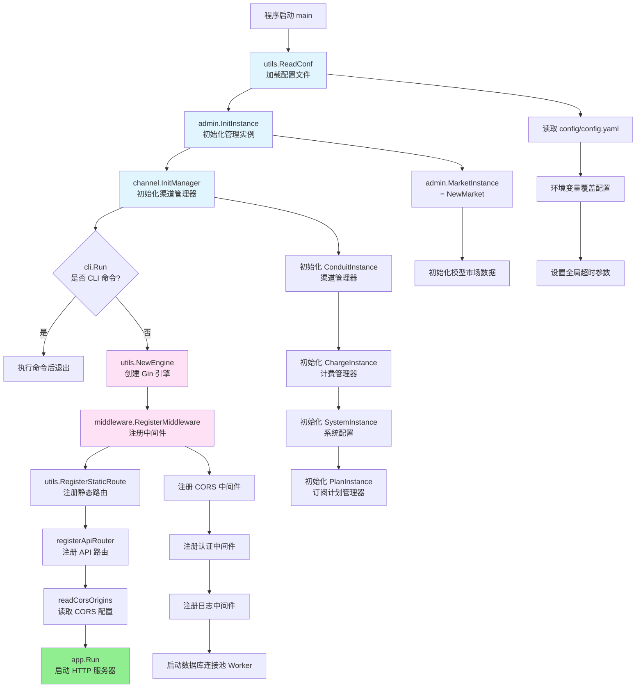

# 程序入口与启动流程

## 入口函数

### 主入口

**文件位置**: `main.go:55`

```go
func main() {
	utils.ReadConf()           // 1. 加载配置
	admin.InitInstance()       // 2. 初始化管理实例
	channel.InitManager()      // 3. 初始化渠道管理器

	if cli.Run() {             // 4. 检查是否为 CLI 命令
		return
	}

	app := utils.NewEngine()                    // 5. 创建 Gin 引擎
	worker := middleware.RegisterMiddleware(app) // 6. 注册中间件
	defer worker()

	utils.RegisterStaticRoute(app)  // 7. 注册静态文件路由
	registerApiRouter(app)          // 8. 注册 API 路由
	readCorsOrigins()               // 9. 读取 CORS 配置

	if err := app.Run(fmt.Sprintf(":%s", viper.GetString("server.port"))); err != nil {
		panic(err)                   // 10. 启动 HTTP 服务器
	}
}
```

---

## CLI 命令支持

项目使用简单的命令行参数处理，而非完整的 CLI 框架（如 cobra）。

### CLI 模块

**文件位置**: `cli/cli.go`

主要功能：
- 检查命令行参数
- 执行特定的运维命令（如数据库操作、用户管理等）
- 返回 `true` 表示已处理命令，程序应退出
- 返回 `false` 表示正常启动 Web 服务

**使用示例**:
```bash
./chatnio --help        # 显示帮助信息
./chatnio --version     # 显示版本信息
# 未指定参数时启动 Web 服务
./chatnio
```

---

## 启动流程详解

### 流程图



---

## 各阶段详细说明

### 1. 配置加载 (utils.ReadConf)

**文件位置**: `utils/config.go:23`

```go
func ReadConf() {
	viper.SetConfigFile(configFile)  // configFile = "config/config.yaml"

	// 如果配置文件不存在，从模板复制
	if !IsFileExist(configFile) {
		fmt.Println(fmt.Sprintf("[service] config.yaml not found, creating one from template: %s", configExampleFile))
		if err := CopyFile(configExampleFile, configFile); err != nil {
			fmt.Println(err)
		}
	}

	if err := viper.ReadInConfig(); err != nil {
		panic(err)
	}

	viper.AutomaticEnv()  // 启用环境变量自动绑定
	viper.SetEnvKeyReplacer(strings.NewReplacer(".", "_"))  // mysql.host -> MYSQL_HOST

	// 设置 HTTP 超时
	if timeout := viper.GetInt("max_timeout"); timeout > 0 {
		globals.HttpMaxTimeout = time.Second * time.Duration(timeout)
		globals.Debug(fmt.Sprintf("[service] http client timeout set to %ds from env", timeout))
	}
}
```

**关键点**:
- 使用 Viper 库进行配置管理
- 支持环境变量覆盖（`mysql.host` → `MYSQL_HOST`）
- 自动从 `config.example.yaml` 创建配置文件
- 配置全局 HTTP 超时参数

---

### 2. 管理实例初始化 (admin.InitInstance)

**文件位置**: `admin/instance.go:5`

```go
func InitInstance() {
	MarketInstance = NewMarket()
}
```

**职责**:
- 初始化 `MarketInstance`（模型市场实例）
- 加载可用的 AI 模型列表和定价信息

**说明**:
虽然函数名为 `InitInstance`，但它主要负责初始化模型市场数据，不涉及数据库初始化。数据库初始化在后续步骤中由 `channel.InitManager` 触发（通过 `connection` 包）。

---

### 3. 渠道管理器初始化 (channel.InitManager)

**文件位置**: `channel/manager.go:16`

```go
func InitManager() {
	ConduitInstance = NewChannelManager()     // 渠道管理
	ChargeInstance = NewChargeManager()       // 计费管理
	SystemInstance = NewSystemConfig()        // 系统配置
	PlanInstance = NewPlanManager()           // 订阅计划
}
```

#### 3.1 NewChannelManager 流程

**文件位置**: `channel/manager.go:23`

```go
func NewChannelManager() *Manager {
	var seq Sequence
	if err := viper.UnmarshalKey("channel", &seq); err != nil {
		panic(err)
	}

	manager := &Manager{
		Sequence:          seq,
		Models:            []string{},
		PreflightSequence: map[string]Sequence{},
	}
	manager.Load()  // 加载渠道和模型

	return manager
}
```

**Load 方法**（`channel/manager.go:41`）:
```go
func (m *Manager) Load() {
	// 1. 加载所有渠道配置
	for _, channel := range m.Sequence {
		if channel != nil {
			channel.Load()
		}
	}

	// 2. 初始化支持的模型列表
	m.Models = []string{}
	for _, channel := range m.GetActiveSequence() {
		for _, model := range channel.GetHitModels() {
			if !utils.Contains(model, m.Models) {
				m.Models = append(m.Models, model)
			}
		}
	}

	// 3. 初始化预检序列（按模型分组的渠道列表）
	m.PreflightSequence = map[string]Sequence{}
	for _, model := range m.Models {
		var seq Sequence
		for _, channel := range m.GetActiveSequence() {
			if channel.IsHit(model) {
				seq = append(seq, channel)
			}
		}
		seq.Sort()  // 按优先级排序
		m.PreflightSequence[model] = seq
	}

	// 4. 更新全局变量
	stamp := time.Now().Unix()
	globals.SupportModels = m.Models
	globals.V1ListModels = globals.ListModels{
		Object: "list",
		Data: utils.Each(m.Models, func(model string) globals.ListModelsItem {
			return globals.ListModelsItem{
				Id:      model,
				Object:  "model",
				Created: stamp,
				OwnedBy: "system",
			}
		}),
	}
}
```

**关键职责**:
- 加载配置文件中的所有渠道（channels）
- 收集所有激活渠道支持的模型
- 为每个模型构建预检序列（Preflight Sequence），按优先级和权重排序
- 更新全局模型列表供 API 使用

---

### 4. CLI 命令检查 (cli.Run)

**文件位置**: `cli/cli.go`

```go
func Run() bool {
	// 检查命令行参数
	// 如果是 CLI 命令，执行后返回 true
	// 否则返回 false，继续启动 Web 服务
}
```

**用途**:
- 提供命令行工具功能（如数据库迁移、用户管理）
- 与 Web 服务共用代码库

---

### 5. 创建 Gin 引擎 (utils.NewEngine)

**文件位置**: `utils/config.go:46`

```go
func NewEngine() *gin.Engine {
	if viper.GetBool("debug") {
		return gin.Default()  // Debug 模式：包含日志和恢复中间件
	}

	gin.SetMode(gin.ReleaseMode)  // 生产模式

	engine := gin.New()
	engine.Use(gin.Recovery())  // 只使用恢复中间件
	return engine
}
```

**说明**:
- Debug 模式：启用详细日志
- Release 模式：仅启用 panic 恢复中间件

---

### 6. 注册中间件 (middleware.RegisterMiddleware)

**文件位置**: `middleware/builtins.go`

```go
func RegisterMiddleware(app *gin.Engine) func() {
	// 注册 CORS 中间件
	app.Use(CorsMiddleware())

	// 注册认证中间件（某些路由需要）
	// app.Use(AuthMiddleware())  // 实际在路由级别应用

	// 启动数据库连接池 Worker
	worker := connection.InitMySQLSafe()

	return func() {
		// 清理函数：关闭数据库连接
		if worker != nil {
			worker.Close()
		}
	}
}
```

**职责**:
- 注册 CORS 中间件（`middleware/cors.go`）
- 初始化数据库连接池（`connection/database.go`）
- 返回清理函数用于 defer 调用

#### 数据库初始化详情

**文件位置**: `connection/database.go:18`

```go
func InitMySQLSafe() *sql.DB {
	ConnectDatabase()
	MysqlWorker(DB)  // 启动连接池监控
	return DB
}

func ConnectDatabase() *sql.DB {
	db := getConn()  // 连接 MySQL 或 SQLite

	db.SetMaxOpenConns(512)
	db.SetMaxIdleConns(64)

	// 创建所有表
	CreateUserTable(db)
	CreateConversationTable(db)
	CreateMaskTable(db)
	CreateSharingTable(db)
	CreatePackageTable(db)
	CreateQuotaTable(db)
	CreateSubscriptionTable(db)
	CreateApiKeyTable(db)
	CreateInvitationTable(db)
	CreateRedeemTable(db)
	CreateBroadcastTable(db)

	// 执行数据库迁移
	if err := doMigration(db); err != nil {
		fmt.Println(fmt.Sprintf("migration error: %s", err))
	}

	DB = db
	return db
}
```

**数据库表**:
- `auth` - 用户认证信息
- `conversation` - 对话历史
- `mask` - 用户自定义面具（角色预设）
- `sharing` - 对话分享
- `package` - 用户套餐
- `quota` - 用户配额
- `subscription` - 订阅信息
- `apikey` - API 密钥
- `invitation` - 邀请码
- `redeem` - 兑换码
- `broadcast` - 系统公告

**初始化根用户**（`connection/database.go:103`）:
```go
func InitRootUser(db *sql.DB) {
	var count int
	err := globals.QueryRowDb(db, "SELECT COUNT(*) FROM auth").Scan(&count)
	if err != nil {
		globals.Warn(fmt.Sprintf("[service] failed to query user count: %s", err.Error()))
		return
	}

	if count == 0 {
		globals.Debug("[service] no user found, creating root user (username: root, password: chatnio123456, email: root@example.com)")
		_, err := globals.ExecDb(db, `
			INSERT INTO auth (username, password, email, is_admin, bind_id, token)
			VALUES (?, ?, ?, ?, ?, ?)
		`, "root", utils.Sha2Encrypt("chatnio123456"), "root@example.com", true, 0, "root")
		if err != nil {
			globals.Warn(fmt.Sprintf("[service] failed to create root user: %s", err.Error()))
		}
	} else {
		globals.Debug(fmt.Sprintf("[service] %d user(s) found, skip creating root user", count))
	}
}
```

---

### 7. 注册静态文件路由 (utils.RegisterStaticRoute)

**文件位置**: `utils/config.go:132`

```go
func RegisterStaticRoute(engine *gin.Engine) {
	if !viper.GetBool("serve_static") {
		// 不提供静态文件服务，返回 404
		engine.NoRoute(func(c *gin.Context) {
			c.JSON(404, gin.H{"status": false, "message": "not found or method not allowed"})
		})
		return
	}

	if !IsFileExist("./app/dist") {
		fmt.Println("[service] app/dist not found, please run `npm run build`")
		return
	}

	// SEO 优化
	ApplySeo(viper.GetString("system.general.title"), viper.GetString("system.general.logo"))
	ApplyPWAManifest(viper.GetString("system.general.pwamanifest"))

	// 注册路由
	engine.GET("/", func(c *gin.Context) {
		c.File("./app/dist/index.cache.html")
	})

	engine.GET("/site.webmanifest", func(c *gin.Context) {
		c.File("./app/dist/site.cache.webmanifest")
	})

	engine.Use(static.Serve("/", static.LocalFile("./app/dist", true)))
	engine.NoRoute(func(c *gin.Context) {
		c.File("./app/dist/index.cache.html")  // SPA 路由支持
	})

	// 重定向旧版 API 路径
	for _, route := range redirectRoutes {
		engine.Any(fmt.Sprintf("%s/*path", route), func(c *gin.Context) {
			c.Request.URL.Path = "/api" + c.Request.URL.Path
			engine.HandleContext(c)
		})
	}
}
```

**两种部署模式**:
1. **`serve_static=true`** (默认): 一体化部署，后端同时提供静态文件服务
2. **`serve_static=false`**: 前后端分离，静态文件由独立的 Nginx/CDN 提供

---

### 8. 注册 API 路由 (registerApiRouter)

**文件位置**: `main.go:37`

```go
func registerApiRouter(engine *gin.Engine) {
	var app *gin.RouterGroup
	if !viper.GetBool("serve_static") {
		app = engine.Group("")       // 路由在根路径 (如 /auth/login)
	} else {
		app = engine.Group("/api")   // 路由在 /api 前缀下 (如 /api/auth/login)
	}

	{
		auth.Register(app)          // 认证相关 API
		admin.Register(app)         // 管理员 API
		adapter.Register(app)       // OpenAI 兼容 API
		manager.Register(app)       // 聊天管理 API
		addition.Register(app)      // 附加功能 API
		conversation.Register(app)  // 对话同步 API
	}
}
```

**路由模块**:
- **auth** (`auth/router.go`): `/auth/*` - 用户登录、注册、配额查询
- **admin** (`admin/router.go`): `/admin/*` - 管理员面板 API
- **adapter** (`adapter/router.go`): `/v1/*` - OpenAI 兼容 API（聊天、模型列表）
- **manager** (`manager/router.go`): `/chat/*` - 聊天会话管理
- **conversation** (`manager/conversation/router.go`): `/conversation/*` - 对话同步
- **addition** (`addition/router.go`): `/addition/*` - 附加功能（文章生成、卡片等）

---

### 9. 读取 CORS 配置 (readCorsOrigins)

**文件位置**: `main.go:21`

```go
func readCorsOrigins() {
	origins := viper.GetStringSlice("allow_origins")
	if len(origins) > 0 {
		globals.AllowedOrigins = utils.Each(origins, func(origin string) string {
			// 移除协议和尾部斜杠
			// 例如：https://chatnio.net/ -> chatnio.net

			if host, err := url.Parse(origin); err == nil {
				return host.Host
			}

			return origin
		})
	}
}
```

**用途**:
- 解析配置文件中的 `allow_origins` 字段
- 标准化域名格式用于 CORS 验证

---

### 10. 启动 HTTP 服务器

**文件位置**: `main.go:72`

```go
if err := app.Run(fmt.Sprintf(":%s", viper.GetString("server.port"))); err != nil {
	panic(err)
}
```

**默认端口**: `8094`（可通过 `config.yaml` 或环境变量 `SERVER_PORT` 配置）

**服务启动成功后**:
- HTTP 服务器监听指定端口
- 接受来自客户端的 HTTP/WebSocket 请求
- 根据路由分发到相应的处理函数

---

## 启动顺序总结

```
main()
 ├─ 1. utils.ReadConf()                    // 加载配置
 ├─ 2. admin.InitInstance()                // 初始化管理实例
 ├─ 3. channel.InitManager()               // 初始化渠道管理
 │   ├─ NewChannelManager()                // 加载渠道和模型
 │   ├─ NewChargeManager()                 // 计费规则
 │   ├─ NewSystemConfig()                  // 系统配置
 │   └─ NewPlanManager()                   // 订阅计划
 ├─ 4. cli.Run()                           // CLI 命令检查
 ├─ 5. utils.NewEngine()                   // 创建 Gin 引擎
 ├─ 6. middleware.RegisterMiddleware()     // 注册中间件
 │   ├─ CorsMiddleware()                   // CORS
 │   └─ connection.InitMySQLSafe()         // 数据库初始化
 │       ├─ ConnectDatabase()              // 连接数据库
 │       ├─ CreateXXXTable()               // 创建表
 │       ├─ InitRootUser()                 // 创建根用户
 │       └─ MysqlWorker()                  // 连接池监控
 ├─ 7. utils.RegisterStaticRoute()         // 静态文件路由
 ├─ 8. registerApiRouter()                 // API 路由
 │   ├─ auth.Register()
 │   ├─ admin.Register()
 │   ├─ adapter.Register()
 │   ├─ manager.Register()
 │   ├─ addition.Register()
 │   └─ conversation.Register()
 ├─ 9. readCorsOrigins()                   // CORS 配置
 └─ 10. app.Run()                          // 启动服务器 (默认 :8094)
```

---

## 关键配置项

### config.yaml 主要配置

```yaml
# 服务器配置
server:
  port: "8094"        # HTTP 端口

# 数据库配置
mysql:
  host: "localhost"   # 留空则使用 SQLite
  port: 3306
  user: "root"
  password: ""
  database: "chatnio"
  tls: false

# Redis 配置
redis:
  host: "localhost"
  port: 6379
  password: ""
  db: 0

# 系统配置
secret: "your-jwt-secret"  # JWT 签名密钥
debug: false               # 调试模式
serve_static: true         # 是否提供静态文件服务
max_timeout: 300           # HTTP 超时（秒）

# CORS 配置
allow_origins:
  - "https://yourdomain.com"

# 渠道配置（示例）
channel:
  - id: 1
    type: "openai"
    name: "OpenAI Official"
    models: ["gpt-3.5-turbo", "gpt-4"]
    priority: 1
    weight: 5
    state: true
    secret: "sk-..."
```

---

## 环境变量覆盖

环境变量格式：配置路径中的 `.` 替换为 `_`，全大写

| 配置项 | 环境变量 | 示例 |
|--------|----------|------|
| `server.port` | `SERVER_PORT` | `SERVER_PORT=8080` |
| `mysql.host` | `MYSQL_HOST` | `MYSQL_HOST=192.168.1.100` |
| `mysql.password` | `MYSQL_PASSWORD` | `MYSQL_PASSWORD=secret` |
| `redis.host` | `REDIS_HOST` | `REDIS_HOST=redis.example.com` |
| `secret` | `SECRET` | `SECRET=my-jwt-secret` |
| `debug` | `DEBUG` | `DEBUG=true` |

---

## 故障排查

### 常见启动问题

1. **MySQL 连接失败**:
   - 现象：`[connection] failed to connect to mysql server`
   - 解决：检查 MySQL 是否运行，配置是否正确，或留空 `mysql.host` 使用 SQLite

2. **端口被占用**:
   - 现象：`bind: address already in use`
   - 解决：修改 `server.port` 配置或停止占用端口的进程

3. **配置文件不存在**:
   - 现象：`config.yaml not found`
   - 解决：程序会自动从 `config.example.yaml` 复制，检查该文件是否存在

4. **静态文件未构建**:
   - 现象：`app/dist not found, please run npm run build`
   - 解决：`cd app && pnpm build`

5. **数据库表创建失败**:
   - 现象：SQL 错误日志
   - 解决：检查数据库用户权限，确保有 CREATE TABLE 权限
