# 核心调用链

本文档详细分析 Chat Nio 的核心业务流程，以聊天请求处理为主线，展示从 API 接收请求到返回响应的完整调用链。

---

## 核心调用链概览

### 聊天请求处理主流程

```
HTTP Request
    ↓
Gin Router (/api/v1/chat/completions)
    ↓
manager.ChatRelayAPI (manager/chat_completions.go:39)
    ↓
├─ 认证检查
├─ 参数验证
├─ 配额检查
└─ 分流处理
    ├─ Stream 模式 → sendStreamTranshipmentResponse
    └─ 非 Stream 模式 → sendTranshipmentResponse
         ↓
channel.NewChatRequestWithCache (channel/worker.go:83)
    ↓
├─ 缓存预检 PreflightCache
│   └─ 缓存命中 → 直接返回
└─ 缓存未命中 → NewChatRequest (channel/worker.go:14)
    ↓
channel.Ticker.Next (channel/ticker.go:65)
    ↓
├─ 按优先级选择渠道
├─ 同优先级按权重随机分配
└─ 遍历所有渠道直到成功或耗尽
    ↓
adapter.NewChatRequest (adapter/request.go:27)
    ↓
├─ 创建 AI 提供商特定请求 createChatRequest (adapter/adapter.go:49)
├─ 重试逻辑（QPS 限流、网络错误）
└─ 调用具体 Adapter
    ↓
具体 Adapter 实现（如 openai.CreateStreamChatRequest）
    ↓
├─ 构造 HTTP 请求
├─ 发送到 AI 提供商 API
└─ 流式处理响应
    ↓
Hook 回调函数（逐块处理响应）
    ↓
├─ utils.Buffer.WriteChunk (缓冲区写入)
├─ Token 计数
├─ 配额计算
└─ 返回给客户端（SSE/JSON）
```

---

## 详细调用链分析

### 1. 入口层：HTTP 请求接收

#### 1.1 路由注册

**文件位置**: `adapter/router.go`

```go
func Register(app *gin.RouterGroup) {
	app.POST("/v1/chat/completions", manager.ChatRelayAPI)
	app.GET("/v1/models", manager.ModelAPI)
	// ... 其他路由
}
```

**说明**:
- 兼容 OpenAI API 规范
- 路径前缀根据 `serve_static` 配置决定（`/api/v1/*` 或 `/v1/*`）

---

### 2. 控制器层：请求处理

#### 2.1 ChatRelayAPI - 主控制器

**文件位置**: `manager/chat_completions.go:39`

**函数调用树**:
```
ChatRelayAPI()
├─ utils.GetUserFromContext() - 获取用户名（从 JWT/API Key）
├─ c.ShouldBindJSON(&form) - 解析请求体
├─ checkEnableState() - 检查配额和权限
│   ├─ auth.CanEnableModelWithSubscription() - 订阅模式检查
│   └─ auth.CanEnableModel() - 普通配额检查
└─ 分流处理
    ├─ sendStreamTranshipmentResponse() - 流式响应 (form.Stream=true)
    └─ sendTranshipmentResponse() - 一次性响应 (form.Stream=false)
```

**关键逻辑**:

1. **认证验证**（`manager/chat_completions.go:45-54`）:
```go
username := utils.GetUserFromContext(c)
if username == "" {
	abortWithErrorResponse(c, fmt.Errorf("access denied for invalid api key"), "authentication_error")
	return
}

if utils.GetAgentFromContext(c) != "api" {
	abortWithErrorResponse(c, fmt.Errorf("access denied for invalid agent"), "authentication_error")
	return
}
```

2. **模型名称预处理**（`manager/chat_completions.go:70-81`）:
```go
// Web 搜索模式：web-gpt-4 → gpt-4 + 自动搜索
if strings.HasPrefix(form.Model, "web-") {
	suffix := strings.TrimPrefix(form.Model, "web-")
	form.Model = suffix
	messages = web.ToSearched(true, messages)
}

// 官方渠道模式：gpt-4-official → gpt-4 (标记为官方)
if strings.HasSuffix(form.Model, "-official") {
	form.Model = strings.TrimSuffix(form.Model, "-official")
	form.Official = true
}
```

3. **配额检查**（`manager/chat_completions.go:83-87`）:
```go
check, plan := checkEnableState(db, cache, user, form.Model, messages)
if check != nil {
	sendErrorResponse(c, check, "quota_exceeded_error")
	return
}
```

---

#### 2.2 sendTranshipmentResponse - 非流式响应

**文件位置**: `manager/chat_completions.go:112`

**函数调用树**:
```
sendTranshipmentResponse()
├─ utils.NewBuffer() - 创建响应缓冲区
├─ channel.NewChatRequestWithCache() - 发起聊天请求（带缓存）
│   ├─ PreflightCache() - 尝试命中缓存
│   └─ NewChatRequest() - 实际请求处理
├─ admin.AnalyseRequest() - 统计分析
├─ CollectQuota() - 扣除配额
└─ c.JSON() - 返回 JSON 响应
```

**核心代码**（`manager/chat_completions.go:116-120`）:
```go
buffer := utils.NewBuffer(form.Model, messages, channel.ChargeInstance.GetCharge(form.Model))
hit, err := channel.NewChatRequestWithCache(cache, buffer, auth.GetGroup(db, user), getChatProps(form, messages, buffer), func(data *globals.Chunk) error {
	buffer.WriteChunk(data)  // Hook 回调：将响应写入缓冲区
	return nil
})
```

**响应格式**（`manager/chat_completions.go:137-161`）:
```go
c.JSON(http.StatusOK, RelayResponse{
	Id:      fmt.Sprintf("chatcmpl-%s", id),
	Object:  "chat.completion",
	Created: created,
	Model:   form.Model,
	Choices: []Choice{
		{
			Index: 0,
			Message: globals.Message{
				Role:         globals.Assistant,
				Content:      buffer.Read(),        // 完整内容
				ToolCalls:    tools,
				FunctionCall: buffer.GetFunctionCall(),
			},
			FinishReason: utils.Multi(tools != nil, ReasonToolCalls, ReasonStop),
		},
	},
	Usage: Usage{
		PromptTokens:     buffer.CountInputToken(),
		CompletionTokens: buffer.CountOutputToken(false),
		TotalTokens:      buffer.CountToken(),
	},
	Quota: utils.Multi[*float32](form.Official, nil, utils.ToPtr(buffer.GetQuota())),
})
```

---

#### 2.3 sendStreamTranshipmentResponse - 流式响应

**文件位置**: `manager/chat_completions.go:215`

**函数调用树**:
```
sendStreamTranshipmentResponse()
├─ go func() - 启动 goroutine 处理请求
│   ├─ channel.NewChatRequestWithCache()
│   └─ 通过 channel 逐块发送响应
└─ c.Stream() - SSE 流式输出
```

**核心逻辑**（`manager/chat_completions.go:223-254`）:
```go
go func() {
	buffer := utils.NewBuffer(form.Model, messages, charge)
	hit, err := channel.NewChatRequestWithCache(
		cache, buffer, group, getChatProps(form, messages, buffer),
		func(data *globals.Chunk) error {
			buffer.WriteChunk(data)

			if !data.IsEmpty() {
				// 通过 channel 发送每个 chunk
				partial <- getStreamTranshipmentForm(id, created, form, data, buffer, false, nil)
			}
			return nil
		},
	)

	// 发送结束标记
	partial <- getStreamTranshipmentForm(id, created, form, &globals.Chunk{Content: ""}, buffer, true, nil)
	close(partial)
}()
```

**SSE 输出**（`manager/chat_completions.go:256-269`）:
```go
c.Stream(func(w io.Writer) bool {
	if resp, ok := <-partial; ok {
		if resp.Error != nil {
			sendErrorResponse(c, resp.Error)
			return false
		}

		c.Render(-1, utils.NewEvent(resp))  // 发送 SSE 事件
		return true  // 继续流式传输
	}

	c.Render(-1, utils.NewEndEvent())  // 发送结束事件
	return false  // 结束流式传输
})
```

---

### 3. 渠道层：负载均衡与重试

#### 3.1 NewChatRequestWithCache - 缓存处理

**文件位置**: `channel/worker.go:83`

**函数调用树**:
```
NewChatRequestWithCache()
├─ utils.Md5Encrypt(utils.Marshal(props)) - 计算请求哈希
├─ PreflightCache() - 缓存预检
│   ├─ cache.Get() - 从 Redis 获取缓存
│   ├─ utils.UnmarshalString() - 反序列化缓存数据
│   └─ hook() - 调用回调返回缓存内容
├─ NewChatRequest() - 缓存未命中，发起实际请求
└─ StoreCache() - 存储响应到缓存
```

**缓存键格式**:
```
chat-cache:{index}:{md5_hash}
```

**缓存策略**:
- 仅对特定模型启用（`globals.CacheAcceptedModels`）
- 使用分片索引（0-N）实现负载分散
- 过期时间：`globals.CacheAcceptedExpire` 秒

---

#### 3.2 NewChatRequest - 渠道选择与重试

**文件位置**: `channel/worker.go:14`

**函数调用树**:
```
NewChatRequest()
├─ ConduitInstance.GetTicker() - 获取模型的渠道 Ticker
│   └─ channel.Manager.HitSequence() - 获取预检序列
├─ for !ticker.IsDone() - 遍历所有渠道
│   ├─ ticker.Next() - 获取下一个渠道
│   │   ├─ GetChannelByPriority() - 按优先级获取渠道
│   │   │   ├─ 同优先级渠道按权重随机选择
│   │   │   └─ 权重算法：加权随机（utils.Intn(total)）
│   │   └─ SkipPriority() - 跳过当前优先级
│   └─ adapter.NewChatRequest() - 调用适配器
│       ├─ 成功 (IsSkipError) → 返回
│       └─ 失败 → 继续下一个渠道
└─ 所有渠道耗尽 → 返回错误
```

**核心代码**（`channel/worker.go:14-39`）:
```go
func NewChatRequest(group string, props *adaptercommon.ChatProps, hook globals.Hook) error {
	ticker := ConduitInstance.GetTicker(props.OriginalModel, group)
	if ticker == nil || ticker.IsEmpty() {
		return fmt.Errorf("cannot find channel for model %s", props.OriginalModel)
	}

	var err error
	for !ticker.IsDone() {
		if channel := ticker.Next(); channel != nil {
			props.MaxRetries = utils.ToPtr(channel.GetRetry())
			if err = adapter.NewChatRequest(channel, props, hook); adapter.IsSkipError(err) {
				return err  // 成功
			}

			globals.Warn(fmt.Sprintf("[channel] caught error %s for model %s at channel %s", err.Error(), props.OriginalModel, channel.GetName()))
		}
	}

	globals.Info(fmt.Sprintf("[channel] channels are exhausted for model %s", props.OriginalModel))

	if err == nil {
		err = fmt.Errorf("channels are exhausted for model %s", props.OriginalModel)
	}

	return err
}
```

---

#### 3.3 Ticker - 渠道迭代器

**文件位置**: `channel/ticker.go`

**Ticker 结构**:
```go
type Ticker struct {
	Sequence Sequence  // 渠道序列（已按优先级排序）
	Cursor   int       // 当前游标
}
```

**核心方法**:

1. **Next() - 获取下一个渠道**（`channel/ticker.go:65`）:
```go
func (t *Ticker) Next() *Channel {
	if t.Cursor >= len(t.Sequence) {
		return nil  // 序列耗尽
	}

	priority := t.Sequence[t.Cursor].GetPriority()
	channel := t.GetChannelByPriority(priority)  // 按优先级和权重选择
	t.SkipPriority(priority)  // 跳到下一个优先级

	return channel
}
```

2. **GetChannelByPriority() - 权重分配算法**（`channel/ticker.go:20`）:
```go
func (t *Ticker) GetChannelByPriority(priority int) *Channel {
	var stack Sequence

	// 收集同优先级的所有渠道
	for idx, channel := range t.Sequence {
		if channel.GetPriority() == priority {
			if idx+1 < len(t.Sequence) && t.Sequence[idx+1].GetPriority() == priority {
				stack = append(stack, channel)
				continue
			}

			if len(stack) == 0 {
				return channel  // 唯一渠道，直接返回
			}

			stack = append(stack, channel)
			break
		}
	}

	// 加权随机选择
	weight := utils.Each(stack, func(channel *Channel) int {
		return channel.GetWeight()
	})
	total := utils.Sum(weight)
	cursor := utils.Intn(total)  // 随机数 [0, total)

	// 按权重查找
	for _, channel := range stack {
		cursor -= channel.GetWeight()
		if cursor < 0 {
			return channel
		}
	}

	return stack[0]  // 兜底
}
```

**权重算法示例**:
```
渠道列表（同优先级）:
- Channel A: weight=5
- Channel B: weight=3
- Channel C: weight=2

Total = 10
随机数 cursor = 7

遍历:
1. cursor = 7 - 5 = 2 (>= 0, 继续)
2. cursor = 2 - 3 = -1 (< 0, 选择 Channel B)
```

---

### 4. 适配器层：AI 提供商接口

#### 4.1 adapter.NewChatRequest - 请求分发与重试

**文件位置**: `adapter/request.go:27`

**函数调用树**:
```
adapter.NewChatRequest()
├─ createChatRequest() - 创建特定提供商的请求
│   ├─ props.Model = conf.GetModelReflect() - 模型名映射
│   ├─ channelFactories[factoryType] - 获取工厂函数
│   └─ factory(conf).CreateStreamChatRequest() - 调用具体 Adapter
├─ 错误处理
│   ├─ isQPSOverLimit() - QPS 限流检测
│   │   └─ sleep(500ms) + 递归重试
│   └─ props.Current < retries - 重试次数检查
│       └─ 递归调用 NewChatRequest()
└─ 返回结果
```

**核心代码**（`adapter/request.go:27-48`）:
```go
func NewChatRequest(conf globals.ChannelConfig, props *adaptercommon.ChatProps, hook globals.Hook) error {
	err := createChatRequest(conf, props, hook)

	retries := conf.GetRetry()
	props.Current++

	if IsAvailableError(err) {
		// QPS 限流特殊处理
		if isQPSOverLimit(props.OriginalModel, err) {
			globals.Info(fmt.Sprintf("qps limit for %s, sleep and retry (times: %d)", props.OriginalModel, props.Current))
			time.Sleep(500 * time.Millisecond)
			return NewChatRequest(conf, props, hook)
		}

		// 普通重试
		if props.Current < retries {
			content := strings.Replace(err.Error(), "\n", "", -1)
			globals.Warn(fmt.Sprintf("retrying chat request for %s (attempt %d/%d, error: %s)", props.OriginalModel, props.Current+1, retries, content))
			return NewChatRequest(conf, props, hook)
		}
	}

	return err
}
```

**错误分类**:
- **IsSkipError()**: 成功或可跳过错误（如 "signal" 表示中断）
- **IsAvailableError()**: 可重试错误（网络超时、API 限流等）

---

#### 4.2 createChatRequest - 适配器工厂

**文件位置**: `adapter/adapter.go:49`

**函数调用树**:
```
createChatRequest()
├─ conf.GetModelReflect() - 模型名重定向（如 gpt-3.5 → gpt-3.5-turbo-16k）
├─ conf.GetProxy() - 获取代理配置
├─ channelFactories[factoryType] - 获取工厂函数
│   └─ 示例：openai.NewChatInstanceFromConfig
└─ factory(conf).CreateStreamChatRequest(props, hook)
```

**适配器工厂映射**（`adapter/adapter.go:26`）:
```go
var channelFactories = map[string]adaptercommon.FactoryCreator{
	globals.OpenAIChannelType:      openai.NewChatInstanceFromConfig,
	globals.AzureOpenAIChannelType: azure.NewChatInstanceFromConfig,
	globals.ClaudeChannelType:      claude.NewChatInstanceFromConfig,
	globals.SlackChannelType:       slack.NewChatInstanceFromConfig,
	globals.MidjourneyChannelType:  midjourney.NewChatInstanceFromConfig,
	// ... 其他提供商
}
```

---

#### 4.3 具体 Adapter 实现（以 OpenAI 为例）

**文件位置**: `adapter/openai/chat.go`

**函数调用树**（简化）:
```
CreateStreamChatRequest()
├─ utils.Post() - 构造 HTTP POST 请求
│   ├─ Header: Authorization, Content-Type
│   └─ Body: ChatCompletionRequest
├─ 响应处理
│   ├─ Stream 模式
│   │   ├─ utils.EventSource() - SSE 解析
│   │   └─ 逐行解析 "data: {...}"
│   └─ 非 Stream 模式
│       └─ 一次性解析 JSON
├─ 数据转换
│   ├─ 提取 content, tool_calls, function_call
│   └─ 构造 globals.Chunk
└─ hook(chunk) - 回调函数
```

**伪代码示例**:
```go
func (c *ChatInstance) CreateStreamChatRequest(props *adaptercommon.ChatProps, hook globals.Hook) error {
	// 1. 构造请求
	request := ChatCompletionRequest{
		Model:       props.Model,
		Messages:    props.Message,
		Stream:      true,
		MaxTokens:   props.MaxTokens,
		Temperature: props.Temperature,
		// ...
	}

	// 2. 发送 HTTP 请求
	response, err := utils.Post(
		c.GetEndpoint("/v1/chat/completions"),
		c.GetHeader(),
		request,
	)

	// 3. 处理流式响应
	scanner := bufio.NewScanner(response.Body)
	for scanner.Scan() {
		line := scanner.Text()
		if strings.HasPrefix(line, "data: ") {
			data := strings.TrimPrefix(line, "data: ")
			if data == "[DONE]" {
				break
			}

			var chunk ChatCompletionChunk
			json.Unmarshal([]byte(data), &chunk)

			// 4. 调用 Hook
			hook(&globals.Chunk{
				Content:      chunk.Choices[0].Delta.Content,
				ToolCall:     chunk.Choices[0].Delta.ToolCalls,
				FunctionCall: chunk.Choices[0].Delta.FunctionCall,
			})
		}
	}

	return nil
}
```

---

### 5. 工具层：缓冲区与计费

#### 5.1 utils.Buffer - 响应缓冲区

**文件位置**: `utils/buffer.go`

**主要方法**:
- `NewBuffer()` - 创建缓冲区
- `WriteChunk(chunk)` - 写入响应块
- `Read()` - 读取完整内容
- `CountInputToken()` - 计算输入 Token 数
- `CountOutputToken()` - 计算输出 Token 数
- `GetQuota()` - 计算配额消耗

**Token 计数逻辑**:
```go
func (b *Buffer) CountInputToken() int {
	if b.InputTokens != -1 {
		return b.InputTokens
	}

	// 使用 tiktoken 库计算
	b.InputTokens = utils.CalcTokens(b.Model, b.Messages)
	return b.InputTokens
}

func (b *Buffer) CountOutputToken(stream bool) int {
	if b.OutputTokens != -1 {
		return b.OutputTokens
	}

	content := b.Read()
	b.OutputTokens = utils.CalcTokens(b.Model, []globals.Message{
		{Role: globals.Assistant, Content: content},
	})
	return b.OutputTokens
}
```

**配额计算**（`utils/buffer.go`）:
```go
func (b *Buffer) GetQuota() float32 {
	if b.Charge == nil {
		return 0
	}

	input := float32(b.CountInputToken())
	output := float32(b.CountOutputToken(false))

	return b.Charge.GetQuota(input, output)
}
```

---

#### 5.2 channel.ChargeInstance - 计费规则

**文件位置**: `channel/charge.go`

**计费模式**:
1. **按 Token 计费** - 输入/输出分别定价
2. **按次数计费** - 每次请求固定价格
3. **按时间计费** - 订阅制

**GetQuota 方法示例**:
```go
func (c *Charge) GetQuota(inputTokens, outputTokens float32) float32 {
	inputCost := inputTokens / 1000 * c.InputPrice   // 每千 Token 价格
	outputCost := outputTokens / 1000 * c.OutputPrice
	return inputCost + outputCost
}
```

---

## 核心时序图

### 流式聊天请求完整时序

```mermaid
sequenceDiagram
    participant Client as 客户端
    participant API as ChatRelayAPI
    participant Channel as channel.NewChatRequest
    participant Ticker as Ticker
    participant Adapter as adapter.NewChatRequest
    participant OpenAI as OpenAI API
    participant Buffer as utils.Buffer

    Client->>API: POST /v1/chat/completions<br/>{model, messages, stream=true}
    API->>API: 认证检查<br/>配额检查
    API->>Channel: NewChatRequestWithCache()
    Channel->>Channel: PreflightCache()<br/>检查 Redis 缓存
    alt 缓存命中
        Channel-->>API: 返回缓存内容
    else 缓存未命中
        Channel->>Ticker: GetTicker(model, group)
        Ticker->>Ticker: 按优先级+权重选择渠道
        Ticker-->>Channel: 返回 Channel
        Channel->>Adapter: NewChatRequest(channel, props, hook)
        Adapter->>Adapter: 模型名映射
        Adapter->>OpenAI: POST /v1/chat/completions<br/>stream=true

        loop 流式响应
            OpenAI-->>Adapter: SSE: data: {delta}
            Adapter->>Buffer: WriteChunk(chunk)
            Buffer->>API: hook(chunk)
            API-->>Client: SSE: data: {delta}
        end

        OpenAI-->>Adapter: SSE: data: [DONE]
        Adapter-->>Channel: 完成
        Channel->>Channel: StoreCache()<br/>存储到 Redis
    end

    API->>API: CollectQuota()<br/>扣除配额
    API-->>Client: SSE: [DONE]
```



---

## 关键分支逻辑

### 错误处理分支


### 并发控制分支

```mermaid
flowchart TD
    A[sendStreamTranshipmentResponse] --> B[创建 channel partial]
    B --> C[启动 goroutine]
    C --> D[NewChatRequestWithCache]

    D --> E{每个响应块}
    E -->|有数据| F[partial <- chunk]
    E -->|无数据| E
    E -->|完成| G[partial <- end<br/>close channel]

    B --> H[c.Stream 主线程]
    H --> I{从 partial 接收}
    I -->|接收到 chunk| J[c.Render SSE event]
    J --> I
    I -->|channel 关闭| K[c.Render [DONE]]

    style C fill:#ffffcc
    style H fill:#ccffcc
```

---

## 关键数据结构

### ChatProps - 聊天请求属性

**文件位置**: `adapter/common/types.go`

```go
type ChatProps struct {
	Model             string              // 当前渠道使用的模型名
	OriginalModel     string              // 用户请求的原始模型名
	Message           []globals.Message   // 对话历史
	MaxTokens         *int                // 最大 Token 数
	Temperature       *float32            // 温度参数
	TopP              *float32            // Top-P 采样
	TopK              *int                // Top-K 采样
	PresencePenalty   *float32            // 存在惩罚
	FrequencyPenalty  *float32            // 频率惩罚
	RepetitionPenalty *float32            // 重复惩罚
	Tools             *globals.Tools      // 工具列表（Function Calling）
	ToolChoice        interface{}         // 工具选择策略
	Proxy             string              // 代理地址
	MaxRetries        *int                // 最大重试次数
	Current           int                 // 当前重试次数
}
```

### globals.Chunk - 响应块

**文件位置**: `globals/types.go`

```go
type Chunk struct {
	Content      string           // 文本内容
	ToolCall     *ToolCall        // 工具调用
	FunctionCall *FunctionCall    // 函数调用（旧格式）
}
```

### globals.Hook - 回调函数

**文件位置**: `globals/types.go`

```go
type Hook func(data *Chunk) error
```

**用途**:
- 流式响应逐块处理
- 写入 Buffer 缓冲区
- 实时返回给客户端（SSE）

---

## 性能优化点

### 1. 缓存机制

**优势**:
- 相同请求直接返回缓存，减少 API 调用
- 降低成本，提升响应速度

**实现细节**:
- 使用 MD5(请求参数) 作为缓存键
- 分片存储（chat-cache:{index}:{hash}）
- 仅对指定模型启用（`globals.CacheAcceptedModels`）

### 2. 连接池复用

**实现**:
- MySQL: `SetMaxOpenConns(512)`, `SetMaxIdleConns(64)`
- HTTP Client: 复用 Transport 和长连接

### 3. 并发处理

**流式响应**:
- Goroutine + Channel 实现异步处理
- 主线程负责 SSE 输出，工作线程负责请求处理

### 4. 负载均衡

**策略**:
- 优先级路由：高优先级渠道优先
- 权重分配：同优先级按权重随机
- 自动故障转移：失败自动切换下一个渠道

---

## 总结

Chat Nio 的核心调用链展示了一个典型的**分层架构**设计：

1. **控制器层** (manager) - 处理 HTTP 请求，参数验证，配额检查
2. **渠道层** (channel) - 负载均衡，缓存管理，重试逻辑
3. **适配器层** (adapter) - AI 提供商接口适配，模型名映射
4. **工具层** (utils) - 缓冲区管理，Token 计数，配额计算

**关键设计模式**:
- **工厂模式**: 适配器工厂（`channelFactories`）
- **策略模式**: 不同 AI 提供商的适配器实现
- **迭代器模式**: Ticker 渠道遍历
- **回调模式**: Hook 函数处理流式响应

**容错机制**:
- 多渠道自动切换
- 请求级别重试
- 缓存降级
- 错误分类处理
