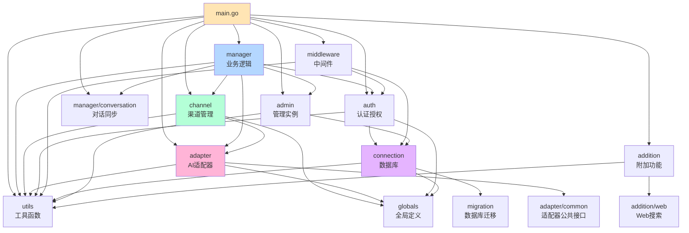
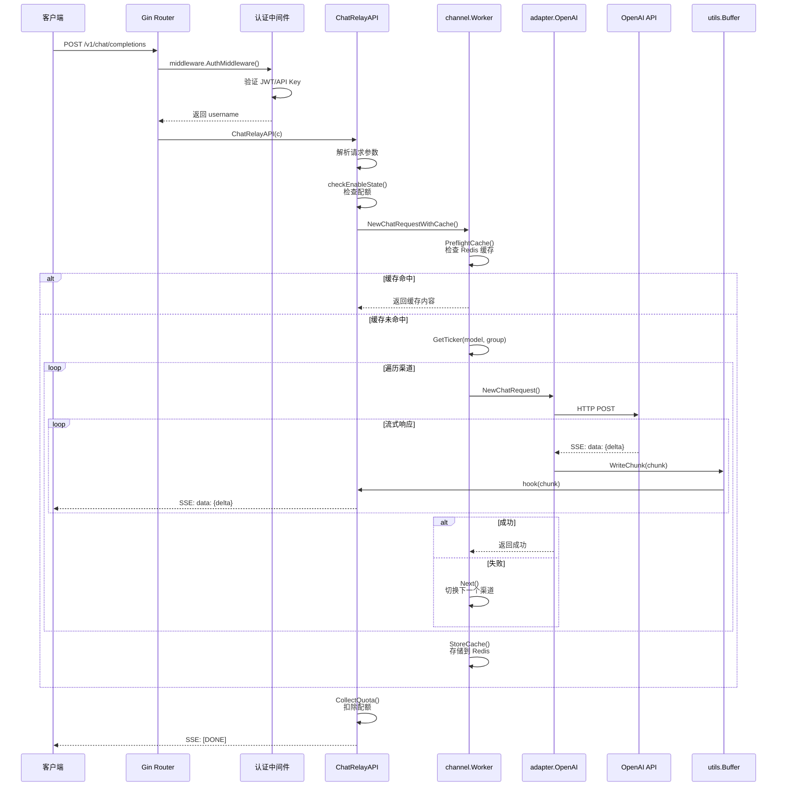
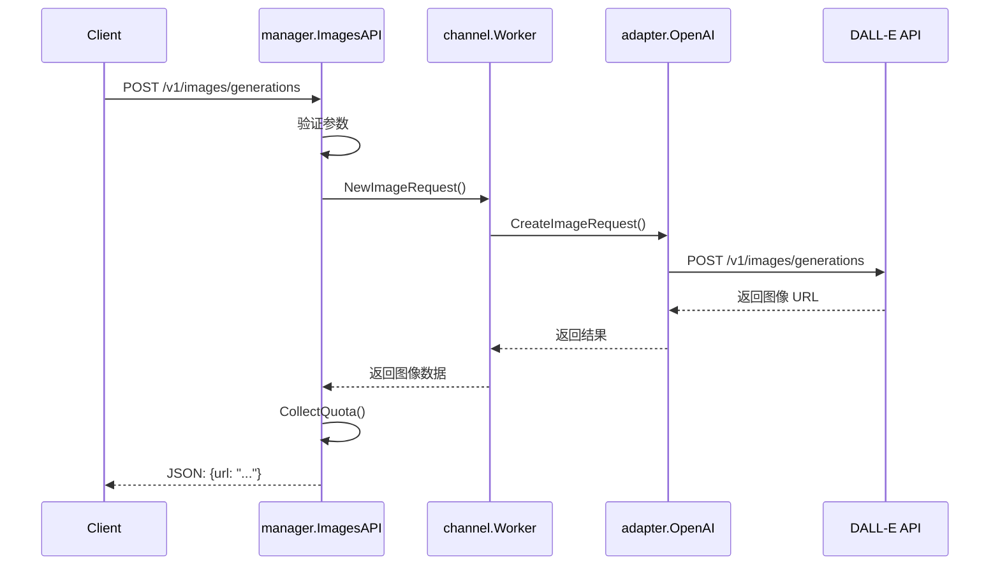
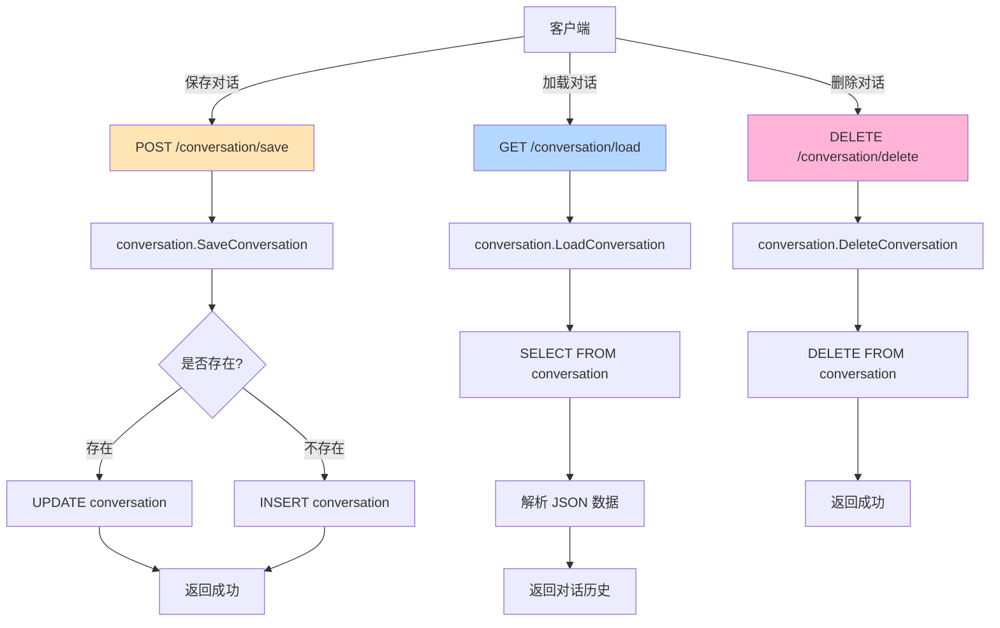
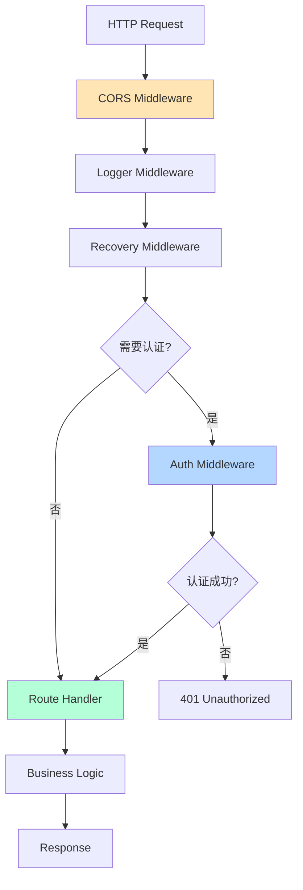
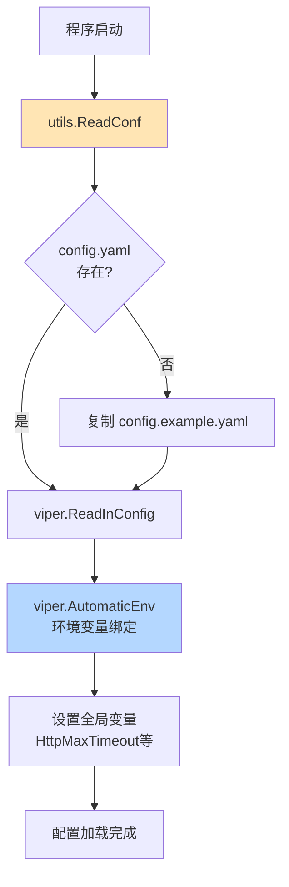

```mermaid
flowchart LR
    A[HTTP Request] --> B[Gin Context]
    B --> C[RelayForm]
    C --> D[ChatProps]
    D --> E[HTTP Request to AI]
    E --> F[SSE Response]
    F --> G[Chunk]
    G --> H[Buffer]
    H --> I[Hook Callback]
    I --> J[SSE to Client]

    style A fill:#FFE5B4
    style G fill:#B4D7FF
    style H fill:#B4FFD7
    style J fill:#FFB4D7
```

# 模块依赖与数据流

本文档分析 Chat Nio 的模块组织结构、依赖关系、核心数据结构以及典型请求的处理流程。

---

## 模块依赖关系图

### 后端模块依赖（Go）



---

## 核心模块详解

### 1. globals - 全局定义

**职责**: 定义全局常量、类型、接口

**关键文件**:
- `globals/types.go` - 数据结构定义
- `globals/channel.go` - 渠道类型常量
- `globals/database.go` - 数据库辅助函数

**核心类型**:

#### Message - 对话消息

```go
type Message struct {
	Role         string        `json:"role"`          // user/assistant/system/tool
	Content      string        `json:"content"`       // 文本内容
	Name         string        `json:"name,omitempty"` // 发送者名称
	ToolCalls    *ToolCalls    `json:"tool_calls,omitempty"` // 工具调用
	ToolCallId   string        `json:"tool_call_id,omitempty"` // 工具调用ID
	FunctionCall *FunctionCall `json:"function_call,omitempty"` // 函数调用（旧格式）
}
```

#### Chunk - 流式响应块

```go
type Chunk struct {
	Content      string        `json:"content"`       // 增量文本
	ToolCall     *ToolCall     `json:"tool_call"`     // 工具调用
	FunctionCall *FunctionCall `json:"function_call"` // 函数调用
}
```

#### Hook - 回调函数类型

```go
type Hook func(data *Chunk) error
```

#### ChannelConfig - 渠道配置接口

```go
type ChannelConfig interface {
	GetId() int
	GetType() string
	GetName() string
	GetModels() []string
	GetModelReflect(model string) string  // 模型名映射
	GetPriority() int
	GetWeight() int
	GetRetry() int
	GetState() bool
	GetProxy() string
	GetSecretValue() string
	IsHit(model string) bool              // 是否支持该模型
	IsHitGroup(group string) bool         // 是否匹配用户组
}
```

---

### 2. connection - 数据库管理

**职责**: 数据库连接、表创建、迁移

**关键文件**:
- `connection/database.go` - 数据库初始化
- `connection/worker.go` - 连接池监控
- `connection/cache.go` - Redis 缓存
- `connection/db_migration.go` - 迁移执行

**数据库表结构**:

#### auth - 用户认证表

```sql
CREATE TABLE auth (
  id INT PRIMARY KEY AUTO_INCREMENT,
  bind_id INT UNIQUE,                    -- 绑定ID（用于第三方登录）
  username VARCHAR(24) UNIQUE,           -- 用户名
  token VARCHAR(255) NOT NULL,           -- 认证令牌
  email VARCHAR(255) UNIQUE,             -- 邮箱
  password VARCHAR(64) NOT NULL,         -- 密码（SHA256加密）
  is_admin BOOLEAN DEFAULT FALSE,        -- 是否管理员
  is_banned BOOLEAN DEFAULT FALSE        -- 是否封禁
);
```

#### quota - 用户配额表

```sql
CREATE TABLE quota (
  id INT PRIMARY KEY AUTO_INCREMENT,
  user_id INT UNIQUE,                    -- 用户ID
  quota DECIMAL(24, 6),                  -- 总配额
  used DECIMAL(24, 6),                   -- 已使用配额
  created_at DATETIME DEFAULT CURRENT_TIMESTAMP,
  updated_at DATETIME DEFAULT CURRENT_TIMESTAMP,
  FOREIGN KEY (user_id) REFERENCES auth(id)
);
```

#### conversation - 对话历史表

```sql
CREATE TABLE conversation (
  id INT PRIMARY KEY AUTO_INCREMENT,
  user_id INT,                           -- 用户ID
  conversation_id INT,                   -- 对话ID（用户自定义）
  conversation_name VARCHAR(255),        -- 对话名称
  data MEDIUMTEXT,                       -- 对话数据（JSON）
  model VARCHAR(255) NOT NULL DEFAULT 'gpt-3.5-turbo-0613',
  task_id VARCHAR(255) NULL,             -- 任务ID（异步任务）
  updated_at DATETIME DEFAULT CURRENT_TIMESTAMP,
  UNIQUE KEY (user_id, conversation_id)
);
```

#### subscription - 订阅表

```sql
CREATE TABLE subscription (
  id INT PRIMARY KEY AUTO_INCREMENT,
  level INT DEFAULT 1,                   -- 订阅级别
  user_id INT UNIQUE,
  expired_at DATETIME,                   -- 过期时间
  created_at DATETIME DEFAULT CURRENT_TIMESTAMP,
  updated_at DATETIME DEFAULT CURRENT_TIMESTAMP,
  total_month INT DEFAULT 0,             -- 累计订阅月数
  enterprise BOOLEAN DEFAULT FALSE,      -- 是否企业版
  FOREIGN KEY (user_id) REFERENCES auth(id)
);
```

**连接策略**:
```go
func getConn() *sql.DB {
	if viper.GetString("mysql.host") == "" {
		// 未配置 MySQL，使用 SQLite
		globals.SqliteEngine = true
		db, _ := sql.Open("sqlite3", "./db/chatnio.db")
		return db
	}

	// 连接 MySQL
	mysqlUrl := fmt.Sprintf("%s:%s@tcp(%s:%d)/%s", user, password, host, port, database)
	db, err := sql.Open("mysql", mysqlUrl)

	if err != nil || db.Ping() != nil {
		// 连接失败，5秒后重试
		time.Sleep(5 * time.Second)
		return getConn()  // 递归重连
	}

	return db
}
```

---

### 3. auth - 认证授权

**职责**: 用户认证、权限验证、配额管理

**关键文件**:
- `auth/auth.go` - JWT认证、用户查询
- `auth/quota.go` - 配额操作
- `auth/subscription.go` - 订阅管理
- `auth/controller.go` - HTTP控制器
- `auth/validators.go` - 参数验证

**核心结构**:

#### User - 用户结构

```go
type User struct {
	Id          int
	Username    string
	Email       string
	Password    string  // SHA256哈希
	IsAdmin     bool
	IsBanned    bool
	Token       string  // JWT Token
}
```

**关键方法**:

```go
// 检查用户是否有足够配额使用模型
func CanEnableModel(db *sql.DB, user *User, model string, messages []Message) error {
	if user == nil {
		return fmt.Errorf("user not found")
	}

	// 管理员无限配额
	if user.IsAdmin {
		return nil
	}

	// 计算预估消耗
	charge := channel.ChargeInstance.GetCharge(model)
	inputTokens := utils.CalcTokens(model, messages)
	estimatedCost := charge.GetQuota(float32(inputTokens), 0)

	// 查询用户配额
	quota := GetUserQuota(db, user.Id)
	if quota.Quota - quota.Used < estimatedCost {
		return fmt.Errorf("insufficient quota")
	}

	return nil
}

// 扣除用户配额
func (u *User) UseQuota(db *sql.DB, amount float32) error {
	_, err := globals.ExecDb(db, `
		UPDATE quota
		SET used = used + ?, updated_at = NOW()
		WHERE user_id = ?
	`, amount, u.Id)
	return err
}
```

---

### 4. channel - 渠道管理

**职责**: 负载均衡、渠道配置、计费规则

**关键文件**:
- `channel/manager.go` - 渠道管理器
- `channel/channel.go` - 渠道定义
- `channel/ticker.go` - 渠道迭代器
- `channel/worker.go` - 请求分发
- `channel/charge.go` - 计费管理
- `channel/plan.go` - 订阅计划
- `channel/system.go` - 系统配置

**核心结构**:

#### Manager - 渠道管理器

```go
type Manager struct {
	Sequence          Sequence              // 所有渠道列表
	Models            []string              // 支持的模型列表
	PreflightSequence map[string]Sequence   // 模型→渠道映射
}
```

#### Channel - 渠道配置

```go
type Channel struct {
	Id       int      `json:"id" mapstructure:"id"`
	Type     string   `json:"type" mapstructure:"type"`         // openai/claude/...
	Name     string   `json:"name" mapstructure:"name"`
	Models   []string `json:"models" mapstructure:"models"`
	Priority int      `json:"priority" mapstructure:"priority"` // 优先级（数字越小越高）
	Weight   int      `json:"weight" mapstructure:"weight"`     // 权重（同优先级随机分配）
	State    bool     `json:"state" mapstructure:"state"`       // 是否启用
	Retry    int      `json:"retry" mapstructure:"retry"`       // 重试次数
	Secret   string   `json:"secret" mapstructure:"secret"`     // API密钥
	Endpoint string   `json:"endpoint" mapstructure:"endpoint"` // 自定义端点
	Proxy    string   `json:"proxy" mapstructure:"proxy"`       // 代理地址
	Group    []string `json:"group" mapstructure:"group"`       // 用户组白名单
	Mapper   []Mapper `json:"mapper" mapstructure:"mapper"`     // 模型名映射
}
```

#### Ticker - 渠道迭代器

```go
type Ticker struct {
	Sequence Sequence  // 渠道序列（已排序）
	Cursor   int       // 当前游标
}
```

**使用示例**:
```go
ticker := manager.GetTicker("gpt-4", "default")  // 获取模型的渠道列表
for !ticker.IsDone() {
	channel := ticker.Next()  // 按优先级+权重获取下一个渠道
	err := adapter.NewChatRequest(channel, props, hook)
	if err == nil {
		break  // 成功
	}
	// 失败，自动尝试下一个渠道
}
```

#### Charge - 计费规则

```go
type Charge struct {
	Type        string   // "tokens" / "times" / "period"
	InputPrice  float32  // 输入价格（每千Token）
	OutputPrice float32  // 输出价格（每千Token）
	FixedPrice  float32  // 固定价格（按次计费）
}
```

**计费方法**:
```go
func (c *Charge) GetQuota(inputTokens, outputTokens float32) float32 {
	switch c.Type {
	case "tokens":
		return (inputTokens / 1000 * c.InputPrice) + (outputTokens / 1000 * c.OutputPrice)
	case "times":
		return c.FixedPrice
	default:
		return 0
	}
}
```

---

### 5. adapter - AI 提供商适配器

**职责**: 统一的 AI API 接口，支持多提供商

**关键文件**:
- `adapter/adapter.go` - 适配器工厂
- `adapter/request.go` - 请求分发与重试
- `adapter/common/types.go` - 公共接口定义
- `adapter/openai/` - OpenAI 适配器
- `adapter/claude/` - Claude 适配器
- `adapter/midjourney/` - Midjourney 适配器
- ...（其他提供商）

**接口定义**:

#### FactoryCreator - 适配器工厂接口

```go
type FactoryCreator func(conf globals.ChannelConfig) Factory

type Factory interface {
	CreateStreamChatRequest(props *ChatProps, hook globals.Hook) error
}

type VideoFactory interface {
	Factory
	CreateVideoRequest(props *VideoProps, hook globals.Hook) error
}
```

**适配器注册**:
```go
var channelFactories = map[string]adaptercommon.FactoryCreator{
	"openai":      openai.NewChatInstanceFromConfig,
	"claude":      claude.NewChatInstanceFromConfig,
	"azure-openai": azure.NewChatInstanceFromConfig,
	"midjourney":  midjourney.NewChatInstanceFromConfig,
	// ...
}
```

**OpenAI 适配器示例**:
```go
type ChatInstance struct {
	Endpoint string
	ApiKey   string
	Model    string
}

func (c *ChatInstance) CreateStreamChatRequest(props *ChatProps, hook globals.Hook) error {
	// 1. 构造请求
	body := ChatCompletionRequest{
		Model:       props.Model,
		Messages:    props.Message,
		Stream:      true,
		MaxTokens:   props.MaxTokens,
		Temperature: props.Temperature,
	}

	// 2. 发送 HTTP POST
	resp, err := utils.Post(c.Endpoint, c.GetHeader(), body)
	if err != nil {
		return err
	}
	defer resp.Body.Close()

	// 3. 解析 SSE 流
	scanner := bufio.NewScanner(resp.Body)
	for scanner.Scan() {
		line := scanner.Text()
		if strings.HasPrefix(line, "data: ") {
			data := strings.TrimPrefix(line, "data: ")
			if data == "[DONE]" {
				break
			}

			var chunk ChatCompletionChunk
			json.Unmarshal([]byte(data), &chunk)

			// 4. 调用 Hook 回调
			hook(&globals.Chunk{
				Content: chunk.Choices[0].Delta.Content,
			})
		}
	}

	return nil
}
```

---

### 6. manager - 业务逻辑层

**职责**: 聊天会话管理、配额收集、统计分析

**关键文件**:
- `manager/chat_completions.go` - OpenAI兼容API
- `manager/chat.go` - 聊天会话管理
- `manager/images.go` - 图像生成
- `manager/videos.go` - 视频生成
- `manager/connection.go` - WebSocket连接
- `manager/types.go` - 数据结构定义
- `manager/conversation/` - 对话同步

**核心方法**:

#### CollectQuota - 配额收集

```go
func CollectQuota(c *gin.Context, user *auth.User, buffer *utils.Buffer, uncountable bool, err error) {
	quota := buffer.GetQuota()

	if user == nil || quota <= 0 {
		return
	}

	if buffer.IsEmpty() || err != nil {
		return  // 请求失败不扣费
	}

	if !uncountable {
		user.UseQuota(utils.GetDBFromContext(c), quota)
	}
}
```

---

### 7. utils - 工具库

**职责**: 通用工具函数、配置管理、WebSocket

**关键文件**:
- `utils/config.go` - 配置加载
- `utils/buffer.go` - 响应缓冲区
- `utils/tokenizer.go` - Token 计数
- `utils/websocket.go` - WebSocket 工具
- `utils/net.go` - HTTP 客户端
- `utils/encrypt.go` - 加密函数

**Buffer - 响应缓冲区**:

```go
type Buffer struct {
	Model        string
	Messages     []globals.Message
	Content      string           // 累积的响应内容
	ToolCalls    *globals.ToolCalls
	FunctionCall *globals.FunctionCall
	InputTokens  int
	OutputTokens int
	Charge       *channel.Charge
}

// 写入响应块
func (b *Buffer) WriteChunk(chunk *globals.Chunk) {
	if chunk.Content != "" {
		b.Content += chunk.Content
	}
	if chunk.ToolCall != nil {
		b.ToolCalls = append(b.ToolCalls, chunk.ToolCall)
	}
	if chunk.FunctionCall != nil {
		b.FunctionCall = chunk.FunctionCall
	}
}

// 计算配额
func (b *Buffer) GetQuota() float32 {
	inputTokens := float32(b.CountInputToken())
	outputTokens := float32(b.CountOutputToken(false))
	return b.Charge.GetQuota(inputTokens, outputTokens)
}
```

---

## 典型请求处理流程

### 聊天完成请求（Stream 模式）

#### 请求示例

```bash
curl -X POST http://localhost:8094/api/v1/chat/completions \
  -H "Authorization: Bearer sk-xxx" \
  -H "Content-Type: application/json" \
  -d '{
    "model": "gpt-4",
    "messages": [
      {"role": "user", "content": "Hello!"}
    ],
    "stream": true
  }'
```

#### 处理流程



#### 数据流



---

### 图像生成请求

#### 请求示例

```bash
curl -X POST http://localhost:8094/api/v1/images/generations \
  -H "Authorization: Bearer sk-xxx" \
  -H "Content-Type: application/json" \
  -d '{
    "model": "dall-e-3",
    "prompt": "A beautiful sunset",
    "n": 1,
    "size": "1024x1024"
  }'
```

#### 处理流程



---

### 对话同步

#### 数据流



---

## API 接口表

### 认证相关 API

| 路径 | 方法 | 入参 | 出参 | 中间件 | 说明 |
|------|------|------|------|--------|------|
| `/auth/login` | POST | `{username, password}` | `{token}` | - | 用户登录 |
| `/auth/register` | POST | `{username, password, email}` | `{token}` | - | 用户注册 |
| `/auth/quota` | GET | - | `{quota, used}` | Auth | 查询配额 |
| `/auth/package` | GET | - | `{packages[]}` | Auth | 查询套餐 |
| `/auth/subscription` | GET | - | `{level, expired_at}` | Auth | 查询订阅 |

### 聊天相关 API

| 路径 | 方法 | 入参 | 出参 | 中间件 | 说明 |
|------|------|------|------|--------|------|
| `/v1/chat/completions` | POST | `{model, messages, stream?}` | `ChatCompletion` / SSE | Auth | OpenAI兼容聊天API |
| `/v1/models` | GET | - | `{models[]}` | - | 获取支持的模型列表 |
| `/v1/images/generations` | POST | `{model, prompt, size}` | `{url}` | Auth | 图像生成 |
| `/chat/completions` | POST | `{model, messages}` | WebSocket/SSE | Auth | WebSocket聊天 |

### 对话管理 API

| 路径 | 方法 | 入参 | 出参 | 中间件 | 说明 |
|------|------|------|------|--------|------|
| `/conversation/save` | POST | `{conversation_id, name, data}` | `{success}` | Auth | 保存对话 |
| `/conversation/load` | GET | `?conversation_id=xxx` | `{data}` | Auth | 加载对话 |
| `/conversation/delete` | DELETE | `?conversation_id=xxx` | `{success}` | Auth | 删除对话 |
| `/conversation/list` | GET | - | `{conversations[]}` | Auth | 对话列表 |

### 管理员 API

| 路径 | 方法 | 入参 | 出参 | 中间件 | 说明 |
|------|------|------|------|--------|------|
| `/admin/users` | GET | - | `{users[]}` | Admin | 用户列表 |
| `/admin/user/quota` | POST | `{user_id, quota}` | `{success}` | Admin | 修改配额 |
| `/admin/channels` | GET | - | `{channels[]}` | Admin | 渠道列表 |
| `/admin/channel/create` | POST | `{channel}` | `{success}` | Admin | 创建渠道 |
| `/admin/statistics` | GET | - | `{stats}` | Admin | 统计数据 |

---

## 中间件处理链

### 请求处理流程



### 中间件详解

#### CORS Middleware
**文件位置**: `middleware/cors.go`

```go
func CorsMiddleware() gin.HandlerFunc {
	return func(c *gin.Context) {
		origin := c.GetHeader("Origin")

		if utils.Contains(extractHost(origin), globals.AllowedOrigins) {
			c.Writer.Header().Set("Access-Control-Allow-Origin", origin)
			c.Writer.Header().Set("Access-Control-Allow-Credentials", "true")
			c.Writer.Header().Set("Access-Control-Allow-Methods", "GET, POST, PUT, DELETE, OPTIONS")
			c.Writer.Header().Set("Access-Control-Allow-Headers", "Content-Type, Authorization")
		}

		if c.Request.Method == "OPTIONS" {
			c.AbortWithStatus(204)
			return
		}

		c.Next()
	}
}
```

#### Auth Middleware
**文件位置**: `middleware/auth.go`

```go
func AuthMiddleware() gin.HandlerFunc {
	return func(c *gin.Context) {
		token := c.GetHeader("Authorization")
		token = strings.TrimPrefix(token, "Bearer ")

		// 1. 尝试 JWT 验证
		if username, err := auth.VerifyJWT(token); err == nil {
			c.Set("username", username)
			c.Set("agent", "jwt")
			c.Next()
			return
		}

		// 2. 尝试 API Key 验证
		if username, err := auth.VerifyAPIKey(token); err == nil {
			c.Set("username", username)
			c.Set("agent", "api")
			c.Next()
			return
		}

		// 3. 认证失败
		c.JSON(401, gin.H{"error": "unauthorized"})
		c.Abort()
	}
}
```

---

## 配置管理

### 配置文件结构 (config.yaml)

```yaml
# 服务器配置
server:
  port: "8094"

# 数据库配置
mysql:
  host: "localhost"
  port: 3306
  user: "root"
  password: ""
  database: "chatnio"

# Redis 配置
redis:
  host: "localhost"
  port: 6379
  password: ""
  db: 0

# JWT 密钥
secret: "your-jwt-secret"

# 系统配置
debug: false
serve_static: true
max_timeout: 300

# 渠道配置
channel:
  - id: 1
    type: "openai"
    name: "OpenAI Official"
    models: ["gpt-3.5-turbo", "gpt-4"]
    priority: 1
    weight: 5
    state: true
    retry: 3
    secret: "sk-..."
    endpoint: ""
    proxy: ""
    group: []
    mapper: []
```

### 配置加载流程



---

## 总结

Chat Nio 采用**分层模块化架构**:

### 核心设计原则

1. **单一职责**: 每个模块只负责特定功能
2. **依赖倒置**: 通过接口解耦模块
3. **开放封闭**: 新增 AI 提供商只需实现接口
4. **配置驱动**: 渠道和计费规则通过配置文件管理

### 模块协作模式

```
客户端请求
  → Gin 路由 (main.go)
  → 中间件 (认证、CORS)
  → 控制器层 (manager)
  → 业务逻辑层 (channel)
  → 适配器层 (adapter)
  → AI 提供商 API
```

### 数据流转

```
HTTP/WebSocket Request
  → Gin Context
  → RelayForm
  → ChatProps
  → HTTP Request to AI
  → Chunk (流式响应块)
  → Buffer (缓冲区)
  → Hook Callback
  → SSE/JSON to Client
```

### 关键数据结构

- **Message**: 对话消息（用户/助手/系统）
- **Chunk**: 流式响应增量
- **Buffer**: 响应缓冲与计费
- **Channel**: 渠道配置
- **Ticker**: 渠道迭代器

通过这种设计，Chat Nio 实现了高可扩展性、高可用性和灵活的计费管理。
