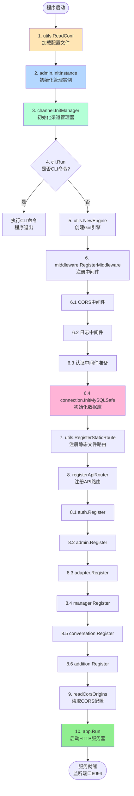
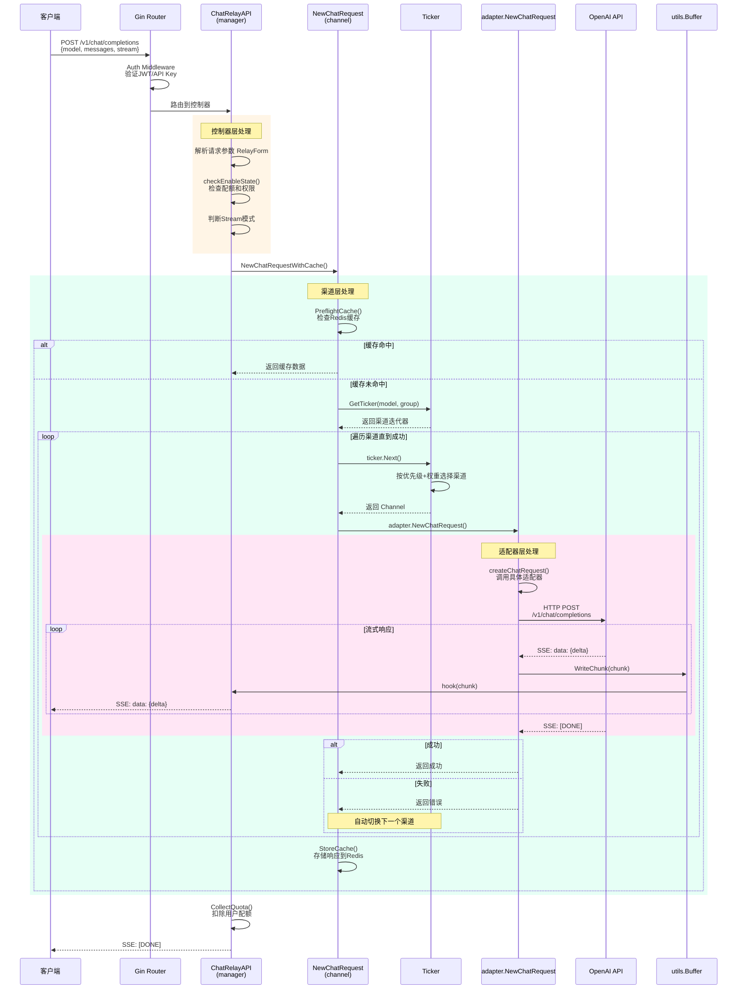
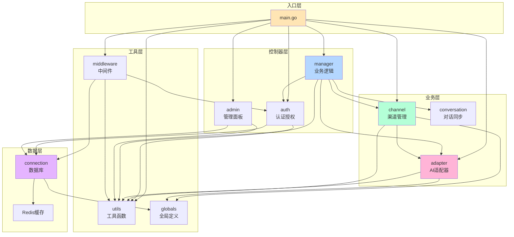
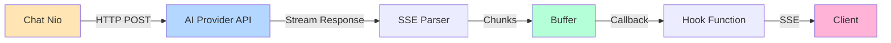
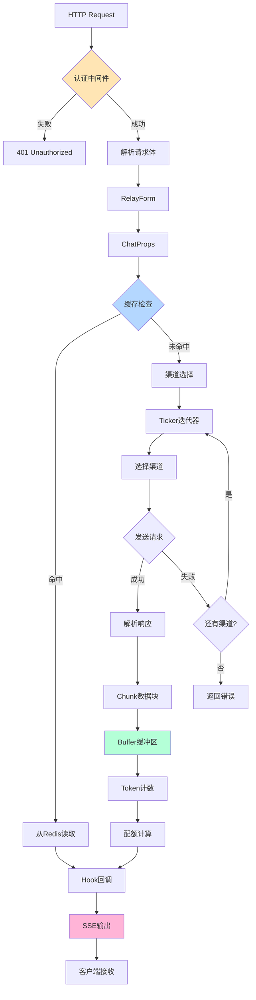

# 系统架构文档

本文档综合呈现 Chat Nio 的完整系统架构，包括整体设计、技术选型、核心流程、模块关系、外部依赖和配置项。

---

## 系统架构综述

Chat Nio 是一个新一代 AIGC 一站式 B/C 端解决方案，采用**前后端分离**的架构设计，提供强大的 API 分发系统和丰富的用户界面。

### 技术栈

```
┌─────────────────────────────────────────────────────────────┐
│                        客户端层                              │
│  React 18 + Redux Toolkit + Radix UI + Tailwind CSS        │
│  PWA + WebSocket + SSE                                      │
└─────────────────────────────────────────────────────────────┘
                            ↓ HTTP/WebSocket
┌─────────────────────────────────────────────────────────────┐
│                        服务端层                              │
│  Go 1.20 + Gin Framework                                    │
│  ├─ Middleware (CORS, Auth, Logging)                       │
│  ├─ Manager (Business Logic)                               │
│  ├─ Channel (Load Balancing)                               │
│  ├─ Adapter (AI Provider Integration)                      │
│  └─ Utils (Buffer, Tokenizer, WebSocket)                   │
└─────────────────────────────────────────────────────────────┘
                            ↓
┌─────────────────────────────────────────────────────────────┐
│                        数据层                                │
│  MySQL (用户数据、对话历史、配额管理)                        │
│  Redis (缓存、会话、限流)                                    │
│  SQLite (开发环境备选)                                       │
└─────────────────────────────────────────────────────────────┘
                            ↓
┌─────────────────────────────────────────────────────────────┐
│                        外部服务层                            │
│  OpenAI API, Claude API, Gemini API, Midjourney            │
│  国内模型: 文心一言、通义千问、混元等 (15+ 提供商)           │
└─────────────────────────────────────────────────────────────┘
```

### 架构特点

1. **微服务化设计**: 模块解耦，独立部署
2. **多提供商支持**: 统一接口适配 15+ AI 提供商
3. **智能负载均衡**: 优先级路由、权重分配、自动故障转移
4. **实时通信**: WebSocket + SSE 双协议支持
5. **高可用性**: 多渠道冗余、自动重试、缓存降级
6. **灵活计费**: 支持按 Token、按次数、按订阅等多种模式

---

## 顶层目录结构

### 后端（Go）

| 目录 | 作用 | 关键文件 | 说明 |
|------|------|----------|------|
| **/** | 项目根目录 | `main.go`, `go.mod` | 程序入口和依赖管理 |
| **adapter/** | AI 提供商适配器 | `adapter.go`, `request.go` | 统一的 AI API 接口 |
| **adapter/openai/** | OpenAI 适配器 | `chat.go`, `instance.go` | GPT 系列模型支持 |
| **adapter/claude/** | Claude 适配器 | `chat.go`, `instance.go` | Claude 系列模型支持 |
| **adapter/midjourney/** | Midjourney 适配器 | `chat.go`, `types.go` | 图像生成支持 |
| **adapter/common/** | 适配器公共接口 | `types.go`, `factory.go` | 定义统一接口 |
| **channel/** | 渠道管理系统 | `manager.go`, `ticker.go` | 负载均衡和路由 |
| **manager/** | 业务逻辑层 | `chat_completions.go`, `chat.go` | 聊天、图像、视频管理 |
| **manager/conversation/** | 对话同步 | `conversation.go`, `sync.go` | 对话历史管理 |
| **manager/broadcast/** | 广播系统 | `broadcast.go` | 实时消息推送 |
| **auth/** | 认证授权 | `auth.go`, `quota.go` | 用户认证和配额管理 |
| **admin/** | 管理面板 | `controller.go`, `user.go` | 管理员 API |
| **connection/** | 数据库管理 | `database.go`, `worker.go` | 数据库连接和表创建 |
| **middleware/** | HTTP 中间件 | `auth.go`, `cors.go` | CORS、认证、限流 |
| **utils/** | 工具库 | `config.go`, `buffer.go` | 配置、缓冲区、工具函数 |
| **globals/** | 全局定义 | `types.go`, `channel.go` | 常量、类型、接口 |
| **migration/** | 数据库迁移 | `*.go` | 版本迁移脚本 |
| **addition/** | 附加功能 | `article/`, `web/`, `card/` | 文章生成、Web 搜索等 |
| **cli/** | 命令行工具 | `cli.go` | CLI 命令支持 |

### 前端（React）

| 目录 | 作用 | 关键文件 | 说明 |
|------|------|----------|------|
| **app/src/** | 前端源码 | `App.tsx`, `main.tsx` | 应用入口 |
| **app/src/components/** | UI 组件 | `*.tsx` | 可复用组件 |
| **app/src/routes/** | 页面路由 | `*.tsx` | 页面组件 |
| **app/src/admin/** | 管理后台 | `*.tsx` | 管理面板页面 |
| **app/src/store/** | 状态管理 | `*.ts` | Redux slices |
| **app/src/api/** | API 调用 | `*.ts` | 后端接口封装 |
| **app/src/types/** | 类型定义 | `*.ts` | TypeScript 类型 |
| **app/src/assets/** | 静态资源 | `globals.less`, `i18n/*.json` | 样式和国际化 |
| **app/public/** | 公共资源 | `index.html`, `favicon.ico` | HTML 模板 |
| **app/dist/** | 构建输出 | 构建后的静态文件 | 生产部署文件 |

---

## 系统启动流程

### 启动流程图



### 启动阶段说明

#### 阶段 1: 配置加载
**文件**: `utils/config.go:23`

```go
func ReadConf() {
	viper.SetConfigFile("config/config.yaml")
	viper.ReadInConfig()
	viper.AutomaticEnv()  // 环境变量覆盖
	viper.SetEnvKeyReplacer(strings.NewReplacer(".", "_"))
}
```

**功能**:
- 读取 `config/config.yaml`
- 环境变量自动绑定（`MYSQL_HOST` 覆盖 `mysql.host`）
- 设置全局参数（HTTP 超时等）

#### 阶段 2-3: 实例初始化

```go
admin.InitInstance()    // 初始化模型市场
channel.InitManager()   // 初始化渠道管理、计费、订阅计划
```

**渠道加载流程**:
1. 从配置文件读取渠道列表
2. 按优先级和权重排序
3. 为每个模型构建预检序列（Preflight Sequence）
4. 更新全局模型列表

#### 阶段 4: CLI 检查

```go
if cli.Run() {
	return  // 执行CLI命令后退出
}
```

**CLI 命令示例**:
```bash
./chatnio --help
./chatnio --version
./chatnio migrate  # 数据库迁移
```

#### 阶段 5-6: Web 服务初始化

```go
app := utils.NewEngine()                      // 创建Gin引擎
worker := middleware.RegisterMiddleware(app)  // 注册中间件
defer worker()                                // 延迟关闭数据库
```

**中间件注册顺序**:
1. CORS 中间件（跨域支持）
2. Recovery 中间件（Panic 恢复）
3. 数据库连接池启动

#### 阶段 7-8: 路由注册

```go
utils.RegisterStaticRoute(app)  // 静态文件（前端）
registerApiRouter(app)           // API 路由
```

**API 路由前缀**:
- `serve_static=true`: `/api/*`（一体化部署）
- `serve_static=false`: `/*`（前后端分离）

#### 阶段 9-10: 服务启动

```go
readCorsOrigins()  // 读取允许的跨域源
app.Run(":8094")   // 启动HTTP服务器
```

---

## 核心调用链

### 聊天请求处理完整调用链



### 函数调用树

```
ChatRelayAPI (manager/chat_completions.go:39)
├─ utils.GetUserFromContext() - 获取用户身份
├─ c.ShouldBindJSON(&form) - 解析请求
├─ checkEnableState() - 配额检查
│   ├─ auth.CanEnableModelWithSubscription() - 订阅模式
│   └─ auth.CanEnableModel() - 普通配额
└─ sendStreamTranshipmentResponse()
    ├─ utils.NewBuffer() - 创建缓冲区
    ├─ channel.NewChatRequestWithCache()
    │   ├─ PreflightCache() - 缓存预检
    │   │   ├─ cache.Get() - Redis 查询
    │   │   └─ hook(cached_data) - 返回缓存
    │   ├─ NewChatRequest()
    │   │   ├─ GetTicker() - 获取渠道迭代器
    │   │   ├─ ticker.Next() - 获取下一个渠道
    │   │   │   ├─ GetChannelByPriority() - 按优先级选择
    │   │   │   └─ 加权随机算法
    │   │   └─ adapter.NewChatRequest()
    │   │       ├─ createChatRequest()
    │   │       │   ├─ channelFactories[type] - 获取工厂
    │   │       │   └─ factory.CreateStreamChatRequest()
    │   │       │       ├─ utils.Post() - HTTP 请求
    │   │       │       ├─ SSE 解析
    │   │       │       └─ hook(chunk) - 逐块回调
    │   │       └─ 重试逻辑 (QPS 限流、网络错误)
    │   └─ StoreCache() - 存储到 Redis
    ├─ admin.AnalyseRequest() - 统计分析
    └─ CollectQuota() - 扣除配额
        └─ user.UseQuota()
```

---

## 模块依赖关系

### 后端模块依赖图



### 模块职责说明

| 模块 | 职责 | 依赖模块 | 被依赖模块 |
|------|------|----------|------------|
| **main** | 程序入口、路由注册、服务启动 | utils, auth, admin, channel, manager, adapter | - |
| **manager** | 聊天会话管理、图像/视频生成、配额收集 | channel, adapter, auth, utils | main |
| **channel** | 负载均衡、渠道管理、缓存处理 | adapter, utils, globals | manager |
| **adapter** | AI 提供商接口适配、请求重试 | utils, globals | manager, channel |
| **auth** | 用户认证、JWT验证、配额管理 | connection, utils | manager, middleware |
| **connection** | 数据库连接、表创建、迁移 | globals, utils | auth, admin, middleware |
| **middleware** | CORS、认证、日志中间件 | auth, connection, utils | main |
| **utils** | 配置加载、缓冲区、Token计数 | globals | 所有模块 |
| **globals** | 全局常量、类型定义、接口 | - | 所有模块 |

---

## 外部系统集成

### 数据库系统

#### MySQL（主数据库）

**用途**:
- 用户数据存储（auth 表）
- 对话历史（conversation 表）
- 配额管理（quota 表）
- 订阅信息（subscription 表）

**连接配置**:
```yaml
mysql:
  host: "localhost"
  port: 3306
  user: "root"
  password: ""
  database: "chatnio"
  tls: false
```

**连接池配置**:
```go
db.SetMaxOpenConns(512)  // 最大打开连接数
db.SetMaxIdleConns(64)   // 最大空闲连接数
```

**自动降级**:
```go
if viper.GetString("mysql.host") == "" {
	// 未配置MySQL，自动使用SQLite
	db := sql.Open("sqlite3", "./db/chatnio.db")
}
```

#### Redis（缓存系统）

**用途**:
- 响应缓存（chat-cache:*）
- 会话管理（session:*）
- 速率限制（rate-limit:*）
- 实时通信（pub/sub）

**连接配置**:
```yaml
redis:
  host: "localhost"
  port: 6379
  password: ""
  db: 0
```

**缓存键设计**:
```
chat-cache:{index}:{md5_hash}  - 聊天响应缓存
session:{user_id}              - 用户会话
rate-limit:{ip}:{endpoint}     - 速率限制
```

---

### AI 提供商 API

#### 支持的提供商

| 提供商 | 渠道类型 | 支持模型 | 适配器文件 |
|--------|----------|----------|------------|
| **OpenAI** | `openai` | GPT-3.5, GPT-4, GPT-4 Turbo | `adapter/openai/` |
| **Azure OpenAI** | `azure-openai` | GPT 系列（Azure 部署） | `adapter/azure/` |
| **Anthropic Claude** | `claude` | Claude 3, Claude 2 | `adapter/claude/` |
| **Google Gemini** | `palm2` | Gemini Pro, PaLM 2 | `adapter/palm2/` |
| **Midjourney** | `midjourney` | 图像生成 | `adapter/midjourney/` |
| **百度文心一言** | `baichuan` | ERNIE 系列 | `adapter/baichuan/` |
| **阿里通义千问** | `qwen` | Qwen 系列 | `adapter/dashscope/` |
| **腾讯混元** | `hunyuan` | Hunyuan 系列 | `adapter/hunyuan/` |
| **讯飞星火** | `sparkdesk` | Spark 系列 | `adapter/sparkdesk/` |
| **智谱AI** | `chatglm` | ChatGLM 系列 | `adapter/zhipuai/` |
| **DeepSeek** | `deepseek` | DeepSeek 系列 | `adapter/deepseek/` |
| **Moonshot** | `moonshot` | Moonshot 系列 | `adapter/openai/`（兼容） |
| **Groq** | `groq` | Groq 系列 | `adapter/openai/`（兼容） |

#### API 调用流程



#### 请求格式（OpenAI 兼容）

```json
{
  "model": "gpt-4",
  "messages": [
    {"role": "system", "content": "You are a helpful assistant."},
    {"role": "user", "content": "Hello!"}
  ],
  "stream": true,
  "temperature": 0.7,
  "max_tokens": 2000
}
```

#### 响应格式（SSE Stream）

```
data: {"id":"chatcmpl-xxx","object":"chat.completion.chunk","created":1234567890,"model":"gpt-4","choices":[{"index":0,"delta":{"role":"assistant","content":"Hello"},"finish_reason":null}]}

data: {"id":"chatcmpl-xxx","object":"chat.completion.chunk","created":1234567890,"model":"gpt-4","choices":[{"index":0,"delta":{"content":"!"},"finish_reason":null}]}

data: [DONE]
```

---

## 配置项详解

### 完整配置文件示例

```yaml
# ==================== 服务器配置 ====================
server:
  port: "8094"                    # HTTP 服务端口

# ==================== 数据库配置 ====================
mysql:
  host: "localhost"               # 留空使用 SQLite
  port: 3306
  user: "root"
  password: ""
  database: "chatnio"
  tls: false                      # 是否启用 TLS

# ==================== Redis 配置 ====================
redis:
  host: "localhost"
  port: 6379
  password: ""
  db: 0

# ==================== 认证配置 ====================
secret: "your-jwt-secret-key"     # JWT 签名密钥（必须修改）

# ==================== 系统配置 ====================
debug: false                      # 调试模式
serve_static: true                # 是否提供静态文件服务
max_timeout: 300                  # HTTP 超时（秒）

# ==================== CORS 配置 ====================
allow_origins:
  - "https://yourdomain.com"
  - "http://localhost:3000"       # 开发环境

# ==================== 系统设置 ====================
system:
  general:
    title: "Chat Nio"             # 站点标题
    logo: "/logo.png"             # Logo URL
    pwamanifest: ""               # PWA Manifest（JSON）

# ==================== 渠道配置 ====================
channel:
  - id: 1
    type: "openai"                # 渠道类型
    name: "OpenAI Official"       # 渠道名称
    models:                       # 支持的模型
      - "gpt-3.5-turbo"
      - "gpt-4"
      - "gpt-4-turbo"
    priority: 1                   # 优先级（数字越小越高）
    weight: 5                     # 权重（同优先级随机分配）
    state: true                   # 是否启用
    retry: 3                      # 重试次数
    secret: "sk-xxx"              # API 密钥
    endpoint: ""                  # 自定义端点（留空使用默认）
    proxy: ""                     # 代理地址
    group: []                     # 用户组白名单（空=所有用户）
    mapper:                       # 模型名映射
      - source: "gpt-3.5"
        target: "gpt-3.5-turbo-16k"

  - id: 2
    type: "claude"
    name: "Claude Official"
    models:
      - "claude-3-opus"
      - "claude-3-sonnet"
    priority: 2
    weight: 3
    state: true
    retry: 2
    secret: "sk-ant-xxx"
    endpoint: ""
    proxy: ""
    group: ["premium"]            # 仅 premium 用户可用
    mapper: []

# ==================== 计费配置 ====================
charge:
  gpt-3.5-turbo:
    input: 0.0015                 # 输入价格（每千 Token）
    output: 0.002                 # 输出价格（每千 Token）
  gpt-4:
    input: 0.03
    output: 0.06
  claude-3-opus:
    input: 0.015
    output: 0.075

# ==================== 订阅计划 ====================
plan:
  basic:
    level: 1
    price: 9.9
    quota: 100                    # 月度配额
    models:                       # 可用模型
      - "gpt-3.5-turbo"
  pro:
    level: 2
    price: 29.9
    quota: 500
    models:
      - "gpt-3.5-turbo"
      - "gpt-4"
      - "claude-3-sonnet"
```

### 环境变量覆盖

环境变量优先级高于配置文件，格式：配置路径的 `.` 替换为 `_`，全大写。

**示例**:
```bash
export SERVER_PORT=9000
export MYSQL_HOST=192.168.1.100
export MYSQL_PASSWORD=secret123
export REDIS_HOST=redis.example.com
export SECRET=my-jwt-secret
export DEBUG=true
```

**等价于**:
```yaml
server:
  port: "9000"
mysql:
  host: "192.168.1.100"
  password: "secret123"
redis:
  host: "redis.example.com"
secret: "my-jwt-secret"
debug: true
```

---

## 数据流与状态管理

### 请求响应数据流



### 状态管理（前端 Redux）

```
┌─────────────────────────────────────┐
│          Redux Store                │
├─────────────────────────────────────┤
│  auth: {                            │
│    user: User | null,               │
│    token: string,                   │
│    isLoggedIn: boolean              │
│  }                                  │
│  chat: {                            │
│    conversations: Conversation[],   │
│    activeId: number,                │
│    messages: Message[],             │
│    isStreaming: boolean             │
│  }                                  │
│  settings: {                        │
│    theme: 'light' | 'dark',         │
│    language: string,                │
│    model: string                    │
│  }                                  │
│  admin: {                           │
│    users: User[],                   │
│    channels: Channel[],             │
│    stats: Statistics                │
│  }                                  │
└─────────────────────────────────────┘
```

---

## 安全与性能

### 安全机制

1. **认证授权**:
   - JWT Token 认证（过期时间 7 天）
   - API Key 认证（长期有效）
   - 中间件级别拦截

2. **密码加密**:
   - SHA256 哈希存储
   - 密码加盐（Salt）

3. **CORS 保护**:
   - 白名单机制
   - 动态验证 Origin

4. **SQL 注入防护**:
   - 参数化查询
   - 预编译语句

5. **速率限制**:
   - Redis 计数器
   - IP 级别限流

### 性能优化

1. **缓存策略**:
   - Redis 响应缓存（相同请求直接返回）
   - 分片存储（chat-cache:{index}:{hash}）
   - LRU 淘汰策略

2. **连接池**:
   - MySQL: 最大 512 连接，空闲 64
   - HTTP Client: 连接复用

3. **并发处理**:
   - Goroutine 异步处理
   - Channel 管道通信
   - SSE 流式传输

4. **负载均衡**:
   - 优先级路由
   - 权重分配
   - 自动故障转移

---

## 部署架构

### 一体化部署（serve_static=true）

```
┌────────────────────────────────────────┐
│          Nginx (可选反向代理)           │
│          SSL/TLS, Gzip压缩             │
└────────────────┬───────────────────────┘
                 ↓
┌────────────────────────────────────────┐
│        Chat Nio (Go Binary)            │
│  ├─ 静态文件服务 (/)                   │
│  └─ API 服务 (/api/*)                  │
└────────┬───────────────┬───────────────┘
         ↓               ↓
    ┌────────┐      ┌────────┐
    │ MySQL  │      │ Redis  │
    └────────┘      └────────┘
```

### 前后端分离部署（serve_static=false）

```
┌─────────────────┐     ┌─────────────────┐
│  Nginx/CDN      │     │  Nginx          │
│  (静态文件)     │     │  (反向代理)     │
│  React SPA      │     │  API 服务       │
└────────┬────────┘     └────────┬────────┘
         │                       ↓
         │              ┌────────────────┐
         │              │ Chat Nio (Go)  │
         │              │ API Only       │
         │              └───┬──────┬─────┘
         │                  ↓      ↓
         │             ┌────────┐ ┌────────┐
         └─────────────→ MySQL  │ │ Redis  │
           (API 调用)   └────────┘ └────────┘
```

### Docker Compose 部署

```yaml
version: '3.8'
services:
  app:
    image: chatnio/chatnio:latest
    ports:
      - "8094:8094"
    environment:
      - MYSQL_HOST=mysql
      - REDIS_HOST=redis
    volumes:
      - ./config:/config
      - ./logs:/logs
    depends_on:
      - mysql
      - redis

  mysql:
    image: mysql:8.0
    environment:
      - MYSQL_ROOT_PASSWORD=password
      - MYSQL_DATABASE=chatnio
    volumes:
      - ./db:/var/lib/mysql

  redis:
    image: redis:7-alpine
    volumes:
      - ./redis:/data
```

---

## 监控与日志

### 日志系统

**日志级别**:
- `Debug`: 调试信息（开发环境）
- `Info`: 一般信息
- `Warn`: 警告信息（请求失败、渠道切换）
- `Error`: 错误信息（严重问题）

**日志格式**:
```
[2024-01-15 10:30:45] [INFO] [channel] calling video request success (channel: OpenAI, user: alice, model: gpt-4)
[2024-01-15 10:30:46] [WARN] [channel] caught error timeout for model gpt-4 at channel OpenAI
[2024-01-15 10:30:47] [INFO] [channel] channels are exhausted for model gpt-4
```

**日志输出**:
- 标准输出（stdout）
- 文件日志（lumberjack 滚动）

### 统计指标

**admin.AnalyseRequest 收集**:
- 请求总数
- 成功/失败比例
- 平均响应时间
- Token 消耗统计
- 模型使用分布
- 渠道性能分析

---

## 总结

Chat Nio 系统架构的核心优势：

1. **高可扩展性**: 模块化设计，易于添加新的 AI 提供商
2. **高可用性**: 多渠道冗余、自动故障转移、缓存降级
3. **灵活计费**: 支持多种计费模式，满足不同业务需求
4. **实时性**: WebSocket + SSE 双协议支持流式传输
5. **安全性**: JWT 认证、CORS 保护、SQL 注入防护
6. **高性能**: 连接池、缓存、并发处理

**技术亮点**:
- 适配器工厂模式统一 15+ AI 提供商接口
- Ticker 迭代器实现优先级路由和权重分配
- Buffer 缓冲区统一管理 Token 计数和配额计算
- Hook 回调函数实现流式响应的灵活处理
- Redis 缓存减少重复请求，降低成本

**适用场景**:
- AI 聊天应用
- API 代理和分发平台
- 企业级 AI 服务集成
- 多模型对比测试
- AI 应用开发和研究
