# Chat Nio 4+1 架构视图

本文档采用 Philippe Kruchten 的 **4+1 架构视图模型**，从五个不同的视角全面描述 Chat Nio 系统架构。

---

## 4+1 视图模型概述

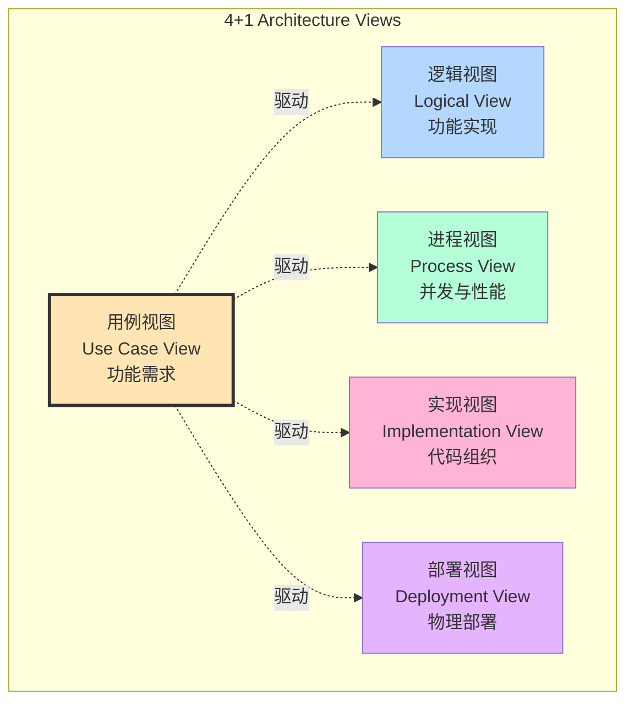

| 视图 | 关注点 | 主要用户 |
|------|--------|----------|
| **用例视图** | 系统功能、外部交互 | 终端用户、产品经理、测试人员 |
| **逻辑视图** | 功能分解、类和对象 | 架构师、开发人员 |
| **进程视图** | 并发、同步、性能 | 系统工程师、性能工程师 |
| **实现视图** | 代码组织、模块结构 | 开发人员、配置管理员 |
| **部署视图** | 物理部署、网络拓扑 | 运维工程师、系统管理员 |

---

## 1. 用例视图 (Use Case View)

### 1.1 系统参与者

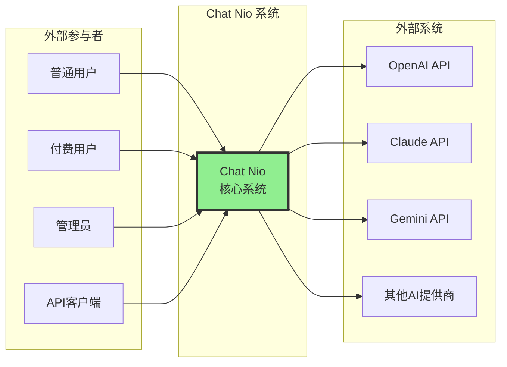

### 1.2 核心用例图

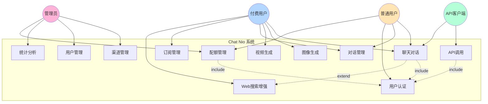

### 1.3 详细用例说明

#### UC1: 聊天对话

**参与者**: 普通用户、付费用户、API客户端

**前置条件**:
- 用户已登录
- 配额充足

**主流程**:
1. 用户选择 AI 模型（gpt-4, claude-3 等）
2. 用户输入消息
3. 系统验证配额
4. 系统选择可用渠道
5. 系统调用 AI 提供商 API
6. 系统流式返回响应
7. 系统扣除配额
8. 系统保存对话历史

**扩展流程**:
- 3a. 配额不足 → 提示用户充值或订阅
- 5a. 渠道失败 → 自动切换下一个渠道
- 5b. 所有渠道失败 → 返回错误信息

**特殊需求**:
- 响应延迟 < 3秒（首字延迟）
- 支持流式输出（SSE）
- 支持 WebSocket 连接

---

#### UC2: 图像生成

**参与者**: 付费用户

**前置条件**:
- 用户已订阅或有足够配额
- 模型支持图像生成（DALL-E, Midjourney）

**主流程**:
1. 用户输入图像描述（prompt）
2. 用户选择尺寸和数量
3. 系统验证权限和配额
4. 系统调用图像生成 API
5. 系统轮询生成状态
6. 生成完成后返回图像 URL
7. 系统扣除配额

**扩展流程**:
- 5a. 生成超时 → 返回失败，不扣费
- 6a. 内容违规 → 返回错误提示

---

#### UC3: 视频生成

**参与者**: 付费用户

**前置条件**:
- 用户已订阅高级计划
- 模型支持视频生成（Sora）

**主流程**:
1. 用户输入视频描述
2. 用户选择视频参数（时长、分辨率）
3. 系统验证权限
4. 系统提交异步任务
5. 系统返回任务 ID
6. 用户轮询任务状态
7. 生成完成后返回视频 URL
8. 系统扣除配额

**特殊需求**:
- 任务保存时间 24 小时
- 支持任务取消

---

#### UC8: 渠道管理

**参与者**: 管理员

**前置条件**:
- 管理员已登录

**主流程**:
1. 管理员查看渠道列表
2. 管理员创建/编辑渠道
3. 配置渠道参数（模型、优先级、权重）
4. 配置 API 密钥和端点
5. 启用/禁用渠道
6. 系统重新加载渠道配置

**特殊需求**:
- 配置热更新（无需重启）
- 支持渠道性能监控

---

#### UC12: API 调用

**参与者**: API 客户端（开发者）

**前置条件**:
- 已获取 API Key

**主流程**:
1. 客户端携带 API Key 发起请求
2. 系统验证 API Key
3. 系统检查调用频率限制
4. 系统处理请求（同 UC1）
5. 系统返回 OpenAI 兼容格式响应
6. 系统记录 API 调用日志

**特殊需求**:
- 完全兼容 OpenAI API 格式
- 支持批量请求
- 频率限制：100 req/min

---

## 2. 逻辑视图 (Logical View)

### 2.1 系统分层架构

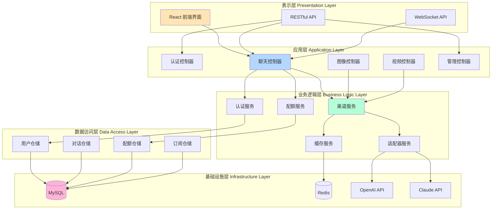

### 2.2 核心类图

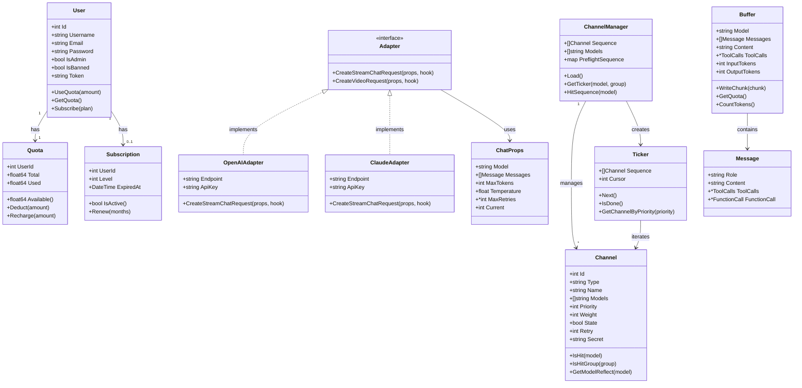

### 2.3 聊天请求序列图

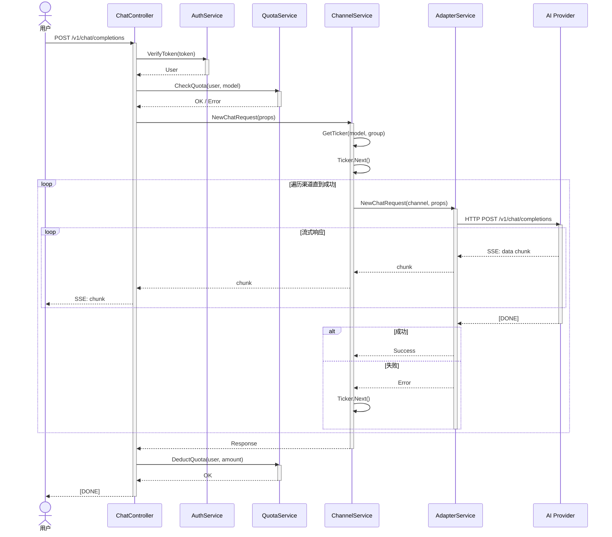

### 2.4 状态图：渠道选择

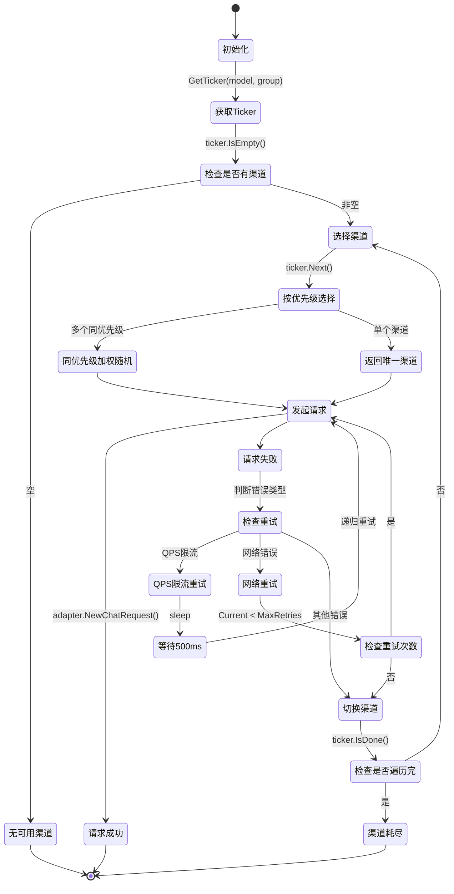

---

## 3. 进程视图 (Process View)

### 3.1 系统并发架构

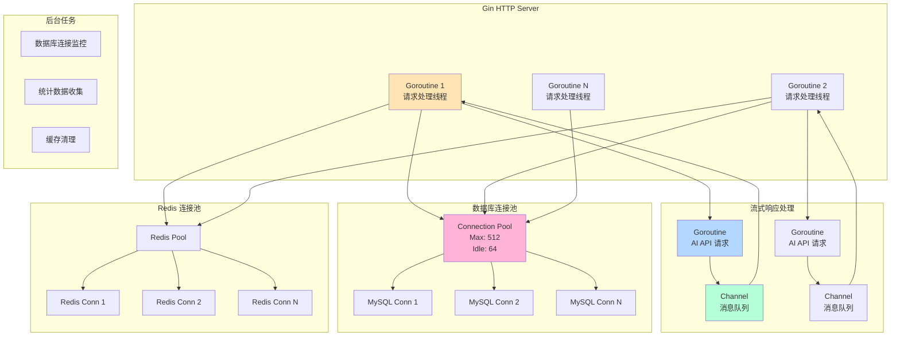

### 3.2 流式响应并发模型

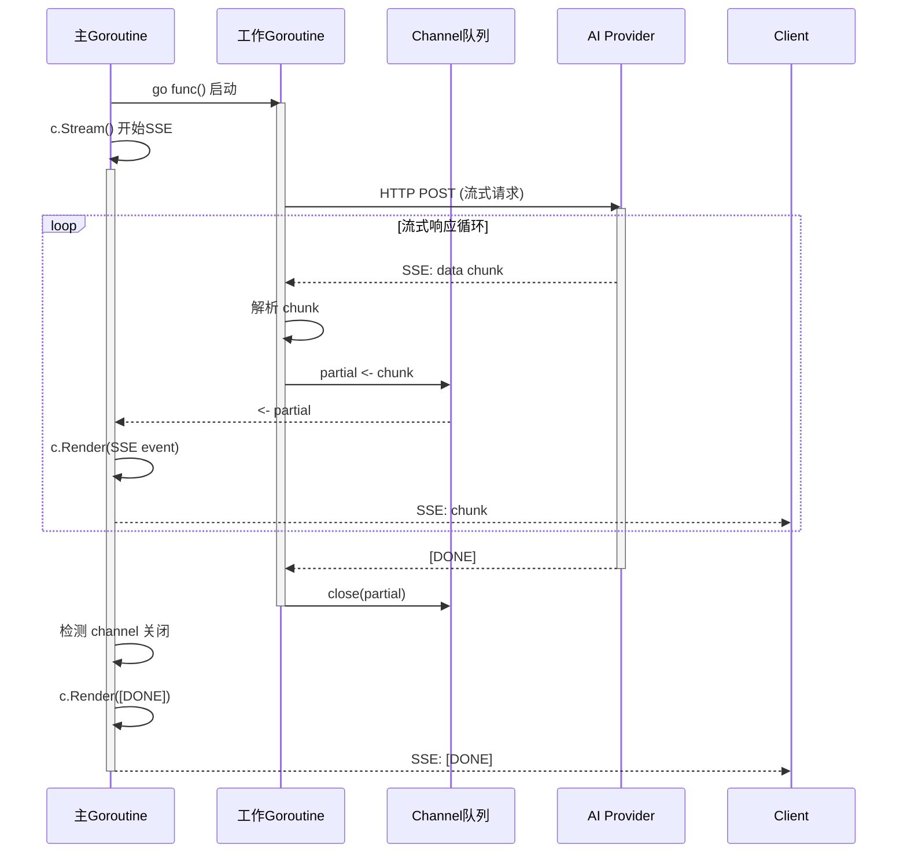

### 3.3 进程间通信

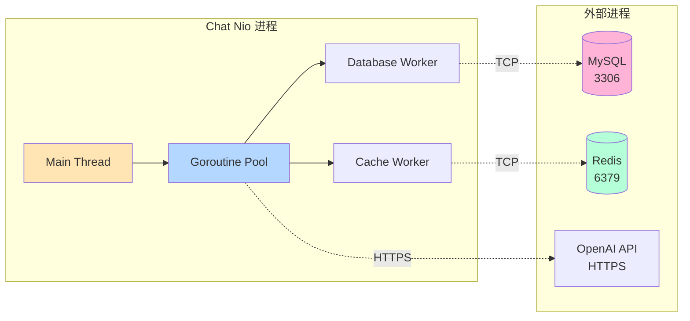

### 3.4 性能指标

| 指标 | 目标值 | 实现方式 |
|------|--------|----------|
| **并发请求数** | 1000+ QPS | Gin + Goroutine 池 |
| **首字延迟** | < 3秒 | 流式响应 + 多渠道冗余 |
| **平均响应时间** | < 5秒（完整响应） | 缓存 + 负载均衡 |
| **数据库连接** | 512 并发连接 | 连接池管理 |
| **缓存命中率** | > 30% | Redis 缓存 + MD5 哈希 |
| **错误率** | < 1% | 多渠道自动重试 |

### 3.5 线程同步机制

```go
// Goroutine + Channel 同步
func sendStreamResponse(c *gin.Context, props *ChatProps) {
    partial := make(chan Response)  // 无缓冲 channel

    // 工作 Goroutine
    go func() {
        err := channel.NewChatRequest(props, func(chunk *Chunk) error {
            partial <- Response{Chunk: chunk}  // 阻塞发送
            return nil
        })
        close(partial)  // 关闭 channel
    }()

    // 主 Goroutine (SSE 输出)
    c.Stream(func(w io.Writer) bool {
        if resp, ok := <-partial; ok {  // 阻塞接收
            c.Render(-1, NewEvent(resp))
            return true  // 继续流式传输
        }
        return false  // 结束
    })
}
```

---

## 4. 实现视图 (Implementation View)

### 4.1 包结构图

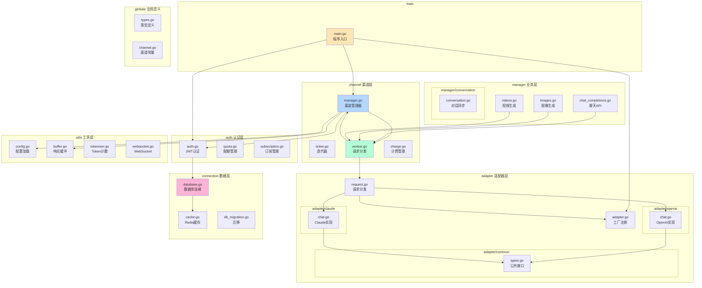

### 4.2 模块依赖矩阵

| 模块 ↓ 依赖 → | main | manager | channel | adapter | auth | connection | utils | globals |
|---------------|------|---------|---------|---------|------|------------|-------|---------|
| **main** | - | ✓ | ✓ | ✓ | ✓ | - | ✓ | - |
| **manager** | - | - | ✓ | - | ✓ | - | ✓ | ✓ |
| **channel** | - | - | - | ✓ | - | - | ✓ | ✓ |
| **adapter** | - | - | - | - | - | - | ✓ | ✓ |
| **auth** | - | - | - | - | - | ✓ | ✓ | ✓ |
| **connection** | - | - | - | - | - | - | ✓ | ✓ |
| **utils** | - | - | - | - | - | - | - | ✓ |
| **globals** | - | - | - | - | - | - | - | - |

**依赖规则**:
- ✓ 表示直接依赖
- 依赖方向：行依赖列
- globals 和 utils 为基础模块，被所有模块依赖
- 无循环依赖

### 4.3 构建与部署流程

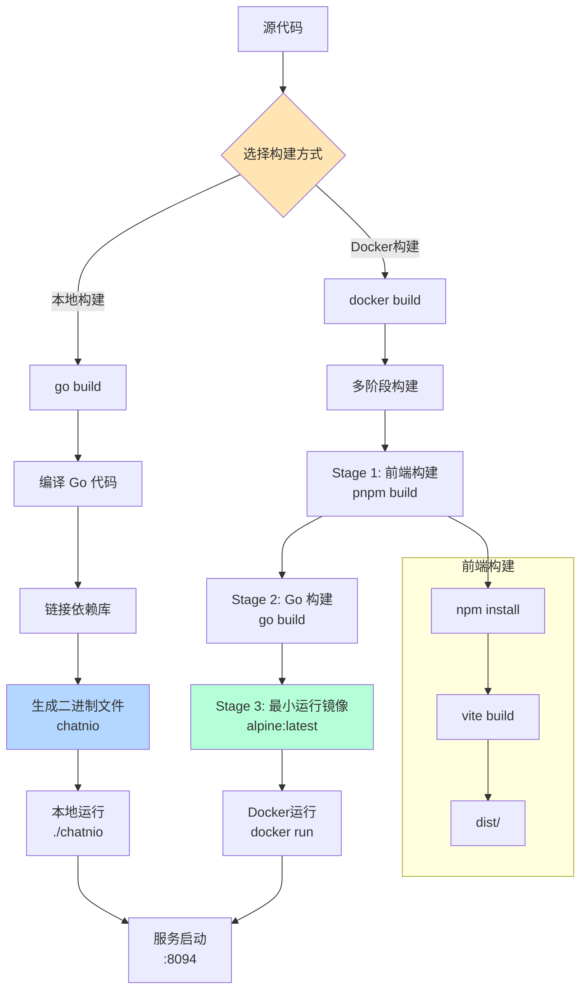

### 4.4 代码组织规范

**文件命名规范**:
```
包名/
├── package.go          # 包的主要逻辑
├── types.go            # 类型定义
├── controller.go       # HTTP 控制器
├── router.go           # 路由注册
├── instance.go         # 实例初始化
└── package_test.go     # 单元测试
```

**import 顺序**:
```go
import (
    // 1. 标准库
    "fmt"
    "time"

    // 2. 第三方库
    "github.com/gin-gonic/gin"
    "github.com/spf13/viper"

    // 3. 本项目包
    "chat/adapter"
    "chat/globals"
    "chat/utils"
)
```

---

## 5. 部署视图 (Deployment View)

### 5.1 物理架构图

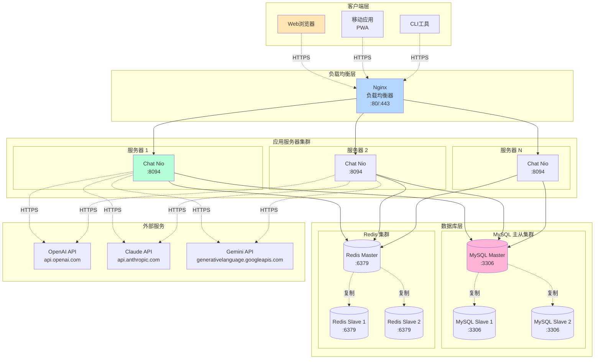

### 5.2 Docker Compose 部署

```yaml
version: '3.8'

services:
  # Nginx 反向代理
  nginx:
    image: nginx:alpine
    ports:
      - "80:80"
      - "443:443"
    volumes:
      - ./nginx.conf:/etc/nginx/nginx.conf
      - ./certs:/etc/nginx/certs
    depends_on:
      - app
    networks:
      - frontend

  # Chat Nio 应用 (可水平扩展)
  app:
    image: chatnio/chatnio:latest
    deploy:
      replicas: 3  # 3个实例
      resources:
        limits:
          cpus: '2'
          memory: 2G
    environment:
      - MYSQL_HOST=mysql
      - MYSQL_PASSWORD=${MYSQL_PASSWORD}
      - REDIS_HOST=redis
      - SECRET=${JWT_SECRET}
    volumes:
      - ./config:/config
      - ./logs:/logs
    depends_on:
      - mysql
      - redis
    networks:
      - frontend
      - backend

  # MySQL 数据库
  mysql:
    image: mysql:8.0
    environment:
      - MYSQL_ROOT_PASSWORD=${MYSQL_PASSWORD}
      - MYSQL_DATABASE=chatnio
    volumes:
      - mysql_data:/var/lib/mysql
    networks:
      - backend
    command: --default-authentication-plugin=mysql_native_password

  # Redis 缓存
  redis:
    image: redis:7-alpine
    command: redis-server --appendonly yes
    volumes:
      - redis_data:/data
    networks:
      - backend

volumes:
  mysql_data:
  redis_data:

networks:
  frontend:
  backend:
```

### 5.3 Kubernetes 部署架构

```mermaid
graph TB
    subgraph "Kubernetes 集群"
        subgraph "Ingress"
            Ingress[Ingress Controller<br/>Nginx/Traefik]
        end

        subgraph "应用 Namespace"
            subgraph "Deployment: chatnio"
                Pod1[Pod 1<br/>chatnio:latest]
                Pod2[Pod 2<br/>chatnio:latest]
                Pod3[Pod 3<br/>chatnio:latest]
            end

            Service[Service: chatnio<br/>ClusterIP]
            HPA[HPA<br/>自动扩缩容<br/>2-10 Pods]
        end

        subgraph "数据 Namespace"
            subgraph "StatefulSet: mysql"
                MySQL[MySQL Pod<br/>PVC: 100Gi]
            end

            subgraph "StatefulSet: redis"
                Redis[Redis Pod<br/>PVC: 20Gi]
            end
        end

        subgraph "配置与密钥"
            ConfigMap[ConfigMap<br/>config.yaml]
            Secret[Secret<br/>API Keys, JWT]
        end
    end

    Ingress --> Service
    Service --> Pod1
    Service --> Pod2
    Service --> Pod3

    HPA -.监控.-> Pod1
    HPA -.扩缩.-> Service

    Pod1 --> MySQL
    Pod2 --> MySQL
    Pod3 --> MySQL

    Pod1 --> Redis
    Pod2 --> Redis
    Pod3 --> Redis

    Pod1 -.挂载.-> ConfigMap
    Pod1 -.挂载.-> Secret

    style Ingress fill:#FFE5B4
    style Service fill:#B4D7FF
    style Pod1 fill:#B4FFD7
    style MySQL fill:#FFB4D7
```

### 5.4 网络拓扑

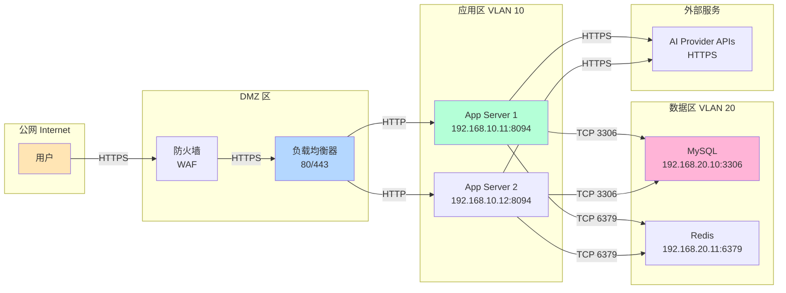

### 5.5 部署配置

#### 服务器规格推荐

| 角色 | CPU | 内存 | 磁盘 | 数量 |
|------|-----|------|------|------|
| **应用服务器** | 4 核 | 8 GB | 100 GB SSD | 2-5 |
| **MySQL** | 8 核 | 16 GB | 500 GB SSD | 1 主 + 1 从 |
| **Redis** | 4 核 | 8 GB | 50 GB SSD | 1 主 + 1 从 |
| **负载均衡器** | 2 核 | 4 GB | 20 GB | 1-2 |

#### 端口映射

```
外部端口          内部端口          服务
80            →   80            →   Nginx (HTTP)
443           →   443           →   Nginx (HTTPS)
              →   8094          →   Chat Nio (App)
              →   3306          →   MySQL
              →   6379          →   Redis
```

#### 防火墙规则

```bash
# 允许 HTTP/HTTPS
iptables -A INPUT -p tcp --dport 80 -j ACCEPT
iptables -A INPUT -p tcp --dport 443 -j ACCEPT

# 应用服务器访问数据库
iptables -A INPUT -s 192.168.10.0/24 -p tcp --dport 3306 -j ACCEPT
iptables -A INPUT -s 192.168.10.0/24 -p tcp --dport 6379 -j ACCEPT

# 拒绝其他访问
iptables -A INPUT -p tcp --dport 3306 -j DROP
iptables -A INPUT -p tcp --dport 6379 -j DROP
```

---

## 6. 场景分析

### 6.1 场景 1: 高并发聊天请求

**场景描述**: 1000 个用户同时发起聊天请求

**各视图分析**:

**用例视图**:
- 参与者: 1000 个普通用户
- 用例: UC1 聊天对话

**逻辑视图**:
- ChatController 接收 1000 个请求
- ChannelService 分配到不同渠道
- 多个 Adapter 并发调用 AI API

**进程视图**:
- Gin 创建 1000 个 Goroutine 处理请求
- 每个请求启动独立的工作 Goroutine
- 数据库连接池复用 512 个连接

**实现视图**:
- manager/chat_completions.go 处理请求
- channel/worker.go 分发到渠道
- adapter/openai/chat.go 调用 API

**部署视图**:
- 负载均衡器分配到 3 个应用实例
- 每个实例处理约 333 个请求
- MySQL 承载 1000 次配额查询/更新

**性能指标**:
- 首字延迟: 2-3 秒
- 完整响应: 10-15 秒
- CPU 使用率: 60-80%
- 内存使用: 4-6 GB

---

### 6.2 场景 2: 渠道故障自动切换

**场景描述**: OpenAI 渠道故障，系统自动切换到 Claude

**各视图分析**:

**用例视图**:
- 用例: UC1 聊天对话
- 扩展流程: 5a. 渠道失败 → 自动切换

**逻辑视图**:
- Ticker.Next() 选择 OpenAI (优先级 1)
- OpenAI Adapter 返回错误
- Ticker.Next() 切换到 Claude (优先级 2)

**进程视图**:
- 主 Goroutine 检测到错误
- 不创建新线程，同步切换渠道
- 重用现有 HTTP 连接池

**实现视图**:
- channel/worker.go:21-30 (循环遍历渠道)
- adapter/request.go:27-48 (重试逻辑)

**部署视图**:
- 应用服务器检测到 OpenAI API 超时
- 切换到 Claude API (不同的网络连接)
- 用户无感知切换

**时间指标**:
- 故障检测: 5 秒（HTTP 超时）
- 切换时间: < 1 秒
- 总延迟增加: 5-6 秒

---

### 6.3 场景 3: 缓存命中

**场景描述**: 相同的请求命中 Redis 缓存

**各视图分析**:

**用例视图**:
- 用例: UC1 聊天对话
- 前置条件: 缓存中存在相同请求

**逻辑视图**:
- CacheService.PreflightCache() 查询 Redis
- 命中后直接返回，跳过 ChannelService

**进程视图**:
- 主 Goroutine 直接返回缓存数据
- 不启动工作 Goroutine
- Redis 连接池复用

**实现视图**:
- channel/worker.go:41-73 (PreflightCache)
- 缓存键: `chat-cache:{index}:{md5_hash}`

**部署视图**:
- 应用服务器查询 Redis 集群
- Redis 返回序列化的 Buffer 对象
- 不访问 AI Provider API

**性能指标**:
- 响应时间: < 100ms（vs 5-10s）
- 成本节省: 100%（无 API 调用）
- 缓存命中率: 30-40%

---

## 7. 关键决策记录

### 7.1 架构决策

| 决策 | 理由 | 权衡 |
|------|------|------|
| **Go + Gin 框架** | 高性能、并发支持好 | 学习曲线略陡 |
| **适配器模式** | 统一多提供商接口 | 增加抽象层 |
| **Ticker 迭代器** | 灵活的渠道选择策略 | 实现复杂度增加 |
| **Goroutine + Channel** | 原生并发支持 | 需要管理 Goroutine 生命周期 |
| **Redis 缓存** | 减少重复调用，降低成本 | 增加缓存一致性管理 |
| **MySQL 主数据库** | 成熟稳定、ACID 保证 | 需要维护数据库集群 |
| **前后端分离** | 独立开发、独立部署 | 跨域和认证复杂度增加 |

### 7.2 技术选型对比

**Web 框架对比**:
| 框架 | 性能 | 生态 | 学习曲线 | 选择理由 |
|------|------|------|----------|----------|
| **Gin** ✓ | ⭐⭐⭐⭐⭐ | ⭐⭐⭐⭐ | ⭐⭐⭐ | 高性能、简洁 |
| Echo | ⭐⭐⭐⭐ | ⭐⭐⭐ | ⭐⭐⭐ | 功能类似 |
| Fiber | ⭐⭐⭐⭐⭐ | ⭐⭐ | ⭐⭐ | 生态较弱 |

**数据库对比**:
| 数据库 | 性能 | 功能 | 运维成本 | 选择理由 |
|--------|------|------|----------|----------|
| **MySQL** ✓ | ⭐⭐⭐⭐ | ⭐⭐⭐⭐⭐ | ⭐⭐⭐ | 成熟稳定 |
| PostgreSQL | ⭐⭐⭐⭐ | ⭐⭐⭐⭐⭐ | ⭐⭐⭐ | 功能更强 |
| MongoDB | ⭐⭐⭐⭐⭐ | ⭐⭐⭐ | ⭐⭐ | 不适合事务 |

---

## 8. 总结

### 8.1 架构优势

1. **分层清晰**: 5 层架构（表示层、应用层、业务层、数据层、基础设施层）
2. **高可扩展**: 适配器模式支持快速接入新的 AI 提供商
3. **高可用**: 多渠道冗余、自动故障转移、缓存降级
4. **高性能**: Goroutine 并发、连接池复用、Redis 缓存
5. **灵活计费**: 支持多种计费模式（Token、次数、订阅）

### 8.2 质量属性

| 属性 | 策略 | 实现 |
|------|------|------|
| **性能** | 并发、缓存、连接池 | Goroutine + Redis + 连接池 |
| **可靠性** | 冗余、重试、降级 | 多渠道 + 自动重试 + 缓存 |
| **可扩展性** | 分层、接口、水平扩展 | 适配器模式 + 无状态应用 |
| **安全性** | 认证、加密、防注入 | JWT + HTTPS + 参数化查询 |
| **可维护性** | 模块化、文档、日志 | 包结构 + 详细文档 + 日志系统 |

### 8.3 未来演进方向

1. **微服务化**: 拆分为独立的认证服务、聊天服务、计费服务
2. **服务网格**: 引入 Istio/Linkerd 管理服务间通信
3. **消息队列**: 使用 Kafka/RabbitMQ 处理异步任务
4. **分布式追踪**: 集成 Jaeger/Zipkin 进行链路追踪
5. **智能调度**: 基于 AI 的渠道选择和负载预测

---

**文档版本**: v1.0
**创建日期**: 2024-01-15
**作者**: Claude
**审阅**: -
